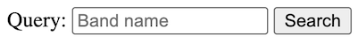

# Lecture Notes for the Continuation Course in Python
{:.no_toc}

Aarne Ranta  
John J. Camilleri


## Preface
{:.no_toc}

This guide is written for the students of the continuation course in Python at Chalmers University of Technology and University of Gothenburg.
The original name of the course was "Advanced Programming in Python", starting in 2021.
As of 2024, the course name is "Continuation Course in Programming in Python", which reflects better its character as an intermediate rather than an advanced course.

The purpose of this guide is to give a unified view of the course and help your learning by showing the big picture and pointing you to further reading.
It is _not_ a complete description of the course material: we found it unnecessary, and even harmful, to repeat and digest all the material that you are expected to read.
On the advanced level of programming, you should be able to read the original documentation, which you can find on the internet, and which may be difficult or even confusing.
This guide will help you to get started, by giving pointers to material that we found relevant and which you _at least_ should read while studying this course.

## Table of contents
{:.no_toc}

* TOC
{:toc}

## 1. Introduction

### 1.1. The aims of this guide and the course

This course is a second course in programming, after an introduction course.
After learning the basics of programming, the ambition here is to reach a level of _completeness_:

* **Complete knowledge of Python**: you will know all constructs of the Python language, not only the ones covered by introduction courses.
* **Universal programming potential**: you will get the confidence that you can solve any programming task, as just a matter of having enough time to study the problem and work on it.

The latter goal is related to the idea of a computer as a **universal machine**, which is able to perform all tasks that an algorithm can do.
What is needed for this is, in addition to the peripheral devices, a programmer that can implement those algorithms on the machine.
The goal of this course is to help you to become that programmer.

Really to become an advanced programmer, you will also need to learn some other things.
This includes courses that are more specific than just programming: they will cover topics such as data structures and algorithms, machine learning, and software engineering.
Even more importantly, you will have to develop your skills by programming in practice.
Another name for the "universal programmer" is **full-stack developer**.
This means a programmer that masters all levels of a practical application.
The term is often used more specifically to mean a web application consisting of a back end, database, and a front end.
This course is centered around a programming project where you will build a full-stack web an application.

### 1.2. Programmers of different kinds

This course is mainly targeted to bachelor-level students, who have studied an introductory Python course.
But it was originally designed, and is still available for, students from different backgrounds - computer science, data science, mathematics, physics, chemistry, design, engineering, business, ecology - and levels - bachelor, masters, PhD.
Many of the mentioned fields have their own cultures of programming.
It is helpful to identify some of them, because you are likely to meet these cultures during your future programmer career.
The following three profiles are of course caricatures, but you can easily find code examples that satisfy all characteristics in each of them.

#### 1.2.1. The Computer Scientist

This is the context in which the course is formally given.
In this context, programming is a branch evolved from applied mathematics.
The programmer is interested in the mathematical structure of programs and tries to find the most elegant data structures and algorithms.
She also wants to make them as general and abstract as possible.
Her programs are typically not solutions to practical problems, but more on the level of **libraries** that can be used by others who are solving practical problems.
The hard-core computer scientist programmer does not primarily use libraries herself - instead, she tries to understand and build everything from the first principles.

Here are some typical features of the Computer Scientist's programs:

* they consist of functions whose size is just a few lines each,
* each function has a clear mathematical description,
* they are often close to pseudocode that could be published in a textbook,
* variable and function names are often short and similar to ones used in mathematics,
* the code avoids language-specific idioms,
* classes are used mainly to define data structures - not to structure entire programs,
* the code is accompanied by arguments about correctness and complexity,
* the code is not tested thoroughly, just demoed with a couple of examples if not proved correct,
* there are very few comments in the code, since it is aimed to be self-explanatory,
* the programs are written by single persons and are self-contained.

With the growing needs of computer programs, Computer Scientist programmers are becoming more and more of a minority.
They have, to some extent, made themselves superfluous by creating libraries that other programmers can rely on and do not need to understand the internals of.
But of course, they are needed in the front line of research to invent new algorithms, new programming languages, and new kinds of computing devices.
It is also common that theoretical Computer Science questions are used in interviews at tech companies.

#### 1.2.2. The Software Engineer

This category contains the majority of programmers who have programming as their profession.
They typically have a Computer Science background, but have "grown up" from that when getting encountered with the "real world".
They have learned several programming languages and have lots of algorithms and data structures in their "toolbox".
At the same time they know that, to solve a practical problem or to create end-user software, no single technique is sufficient in itself.
They have no time to go into the internals of algorithms, but use whatever libraries and tools they - or their managers - have learned to trust.
They often work in large groups and try to maintain a level of readability that enables others in the group take over their code.

Here are some typical features of the Software Engineer's programs:

* they are divided into modules and classes with complex hierarchies,
* each unit of the program is documented in detail with comments and often with diagrams,
* the names of variables, functions, and classes are long, descriptive, and systematic,
* the code is accompanied by a comprehensive set of tests,
* the code uses libraries whenever possible, avoiding to "reinvent the wheel",
* the code has a long lifetime and may have ancient layers that no-one dares to touch any more,
* the full software system may have code written in many languages and typically also contains configuration files and build scripts.

Competent software engineers on different domains of application are constantly and increasingly wanted by employers.
Their competence may be based on academic education, but it is primarily a product of years of experience.
It is not proven by academic degrees or publications, but by a portfolio of software that the programmer has designed or contributed to.
This experience often comes from enterprises, but it can also be built in open source projects where the programmer has made major contributions.

#### 1.2.3. The Occasional Programmer

This is the category of programmers with no or little training in Computer Science.
They can be teenagers or other hobby programmers, but also proficient scientist or engineers in other disciplines, who see programming as something that can be learned in an afternoon or two, when it is needed for some computations or experiments.
For scientists, programming is a replacement of the earlier use of pencil and paper for similar tasks (now decades ago).
Computers make it faster to apply mathematical formulas, and they make it feasible to deal with larger amounts of data than in earlier times, in particular if statistics or machine learning is involved.

Typical features of programs in this category are:

* the structure of the code is simple and linear - in Python, this means that it consists of top-level statements and global variables, avoiding functions and classes,
* the program is a single file that can be thousands of lines long,
* variable names are short and unsystematic,
* input and output is performed freely in different places of the code,
* as there are no return statements, the only way to combine the code with other programs is to pipe its output to them as a string,
* the code uses freely whatever libraries seem to do the job,
* libraries are often imported in the middle of the file rather than in the beginning,
* the code is written by one person and is not intended even to be read by others,
* the code does one thing, aiming to do it with as little effort as possible,
* the code is only run once or a few times,
* well, it is often run with the same input a large number of times, until it seems to do the job in the expected way,
* if a related task appeared again, the code is copied and patched to fit for that purpose.

This category of programmers is probably the largest, and includes both professionals and hobby programmers.
In fact, since Python supports this style so well, it is occasionally used by all kinds of programmers.
Programs in this category are often called **scripts** rather than "real programs".
If you search the web for a Python solution to a particular problem, you are likely to find several examples of this kind of code: scripts with linear structure where large blocks are copies of each other and where input and output happen all over the place.

#### 1.2.4. Programming in this course

The main part of this course belongs to the Software Engineer category:

* we want to solve substantial practical problems,
* we use proven techniques and libraries for this,
* we structure the code in a clear and reusable way,
* we document the code in a way that explains it to other programmers,
* we raise the level of reliability of the code by systematic testing.

As a support for this, we will also look into some Computer Science topics:

* the data model and semantics of Python,
* some fundamental algorithms and their theoretical aspects.

We will neither cover nor recommend the Occasional Programmer's style, not even for highly competent professionals in advanced scientific fields.
If you are a scientist, you are probably right if you think that programming is easy compared with the deeper questions you deal with in your actual research.
But even then, we believe that it is helpful to learn about the algorithms and data structures of the computer scientist, as well as the techniques and practices of the software engineer.
This can make you both faster and more confident when writing code for your next experiment.

One can also compare programming with other hobbies: almost anyone can learn to cook food or play an instrument without any formal training or even without reading books that teach these skills.
But if you take your hobby seriously, it will give you more satisfaction if you know that you are doing it "the right way".

### 1.3. The Lab

Much of the course is centered around the **Lab**, a programming assignment whose goal is to build a "full-stack" web application.
In the final demonstration of the application, the user can search for a route in the Gothenburg tram network and get it drawn on a map - in the way familiar from the numerous travel planning applications on the web.
The Lab is described in detail in three parts
([Lab 1](../labs/lab1/), [Lab 2](../labs/lab2/), and [Lab 3](../labs/lab3/))
so let us here just explain the purpose of the lab in the context of the course.

The Lab is primarily an exercise in practical Software Engineering and serves the following learning outcomes:

* to write modular, well structured programs with reusable components,
* to use standard libraries and understand their documentation,
* to apply testing and version control practices,
* to read and peer review code written by others,
* to document program code so that it can be understood by others,
* to get the basics of some useful techniques (graphs, visualization, web programming) that can be applied to numerous other tasks.

In addition, the Lab has some Computer Science aspects:

* to learn about graphs, which are a fundamental concept in many computing tasks,
* to widen your imagination so that you can search for solutions to practical problems from well-known general algorithms.

The title page of this document shows a screen dump of the final web application.

The standard Lab was in earlier course instances extended with a couple of related tasks, which use graphs for other things than route finding.
They can be found in the "old-labs" directory of the course repository, in case you want to try your hand with them:

* map colouring: making sure that neighbouring countries have different colours,
* machine learning: finding clusters (tightly connected parts) in a network.

The basic lab is estimated to require up to two weeks of working time in total.
The actual time consumption is individual and depends greatly on your previous experience.

## 2. Learning the Python language

One goal of the course is to bring you to a level where they have seen "all of Python".
This does not yet mean that you can use all constructs of Python efficiently.
But you will have at least heard about things like dictionaries, slicing, comprehensions, decorators, inheritance, dunder methods, and other special constructs that might not be familiar from your previous programming language.

### 2.1. What do I learn when I learn a language

Computer scientists and software engineers typically know several programming languages.
They are also comfortable in learning new ones.
Actually, if you are young (say, under 40), it is unlikely that Python will be the language of choice during the rest of your remaining professional life.
Likewise, for most of us over 40 at least, Python is not our first programming language, but it can be, for instance, Java or Haskell or C or Pascal.

When learning your second or third programming language, you certainly do not need to learn everything that absolute beginners are taught their first programming language.
You only need, so to say, learn the _differences_ between the new language and your earlier ones.

The situation resembles learning a _second language_ when you already know your native language - for instance, learning English when you already know Swedish.
It has probably taken you at least seven years to learn to speak, read, and write Swedish fluently.
You have had to learn not only what words mean which things, but also the very idea that words can stand for things, and that written signs can represent sounds.
While learning this, your brain and motoric skills have developed to use a language.
If you start learning English at this point, most of this infrastructure is already in place.
Therefore, it is not uncommon to learn a new language fairly well in a couple of months, which is totally unconceivable when a child learns its first language.

So let us assume, analogously to Java programmers learning Python, that you are a native speaker of Swedish beginning to learn English.
You know that the language consists of words, which are combined to phrases and sentences.
What you need to learn is

* syntax: how phrases and sentences are formed,
* vocabulary: what words are used for what things.

In many cases, learning the syntax of a new language is a task that can be completed in a couple of weeks, since it will not be very different from your earlier languages.
You will learn, for instance, that negation in English is formed in a different way from Swedish, by using auxiliary verbs (_I don't know_ instead of _I know not_).
It might take longer to use _actively_ all parts of the syntax, but you will at least understand the structure of what you read, even if you need to look up words in a dictionary.

The vocabulary, in contrast to syntax, involves life-long learning.
Even native speakers may occasionally need to look up a word in a dictionary.

Now, when learning Python on top of Java (or any other programming language on top of any other one), it is a good idea to start with the syntax - more precisely, how its syntax differs from Java, "how negation is expressed in Python" (yes, it uses the keyword `not` instead of the operator `!`).
Most of this will be fairly obvious and follow a handful of general rules, while some things have no counterparts in Java.
At the same time, some things available in Java are not available in Python, and for those things you will have to learn to express them in a different way.

Within a week or so - Python syntax is a lot easier than English - you will be able to understand the syntactic structure of everything that is written in Python.
There may be things you will never use in your own code, and will probably have a bias for Java-like expression - just like Swedish native speakers, even when fluent in English, can be biased to Swedish-like constructs.

In this course, we will actually try to help you become more _Pythonic_, since this will give you some satisfaction as well as credibility among _Pythonistas_.
But I must confess that, since my own "native" programming language is not Python, I cannot guarantee always to be Pythonic myself.

What about the vocabulary of Python?
There are 35 **reserved words** ("keywords"), and they are quickly learned as a part of the syntax.
In addition, there are 68 **built-in functions**, many of which you will not need any time soon.
But the main bulk of the vocabulary is in **library functions and classes**, and they involve life-long learning.
The only viable approach is to learn to "look up words in the dictionary", that is, search for class and function names in library documentation.

### 2.2. Some characteristics of Python syntax

#### 2.2.1. Modules, classes, functions, statements

Assuming that your first language is Java, you have probably started with a "Hello World" program like this one:

```java
class Hello {
    public static void main(String args[]){
        System.out.println("Hello World");
    }
}
```

In order to run it, you have first compiled it to Java bytecode with the 'javac' program, and then executed the resulting binary with the 'java' program:

```sh
$ javac Hello.java
$ java Hello
Hello World
```

If you mechanically convert your Java program into Python code, you will get

```python
class Hello:
    def main():
        print("Hello World")

Hello.main()
```

In order to run this, you just need to run 'python' (often named 'python3' to distinguish it from earlier versions):

```sh
$ python3 hello.py
Hello World
```

In other words, there is no separate step of compilation, but you can "run your program directly".
(In reality, there is a compilation phase to Python's bytecode, but it happens behind the scenes.)
Thus running the code is simpler, but the code itself is about as complicated as in Java.

However, the code shown above is what you end up with if you directly convert your Java thinking into Python.
The "normal" Hello World program in Python is much simpler:

```python
print("Hello World")
```

This program consists of a single statement - no class, no function is needed.
There is also an intermediate way to write the same program, which contains a function but no class:

```python
def main():
    print("Hello World")

main()
```

If your background is in C or Haskell rather than Java, this will probably be the most natural way to write the Hello World program.

The Hello World examples illustrate the different levels in which programs are structured in both Java and Python, and also in many other languages:

* modules (typically files),
* classes,
* functions (or "methods"),
* statements,
* expressions.

In Java, these levels are strictly nested: expressions reside inside statements, statements inside functions, functions inside classes, and classes are the top-level structure of modules.
In Python, the same strict hierarchy _can_ be followed, but this is not compulsory.
It is common that a top-level module is a mixture of classes, functions, and statements.
An extreme case is a module consisting only of statements: this is the dominating style in what we called "occasional programming" and has given Python the label "scripting language".

Even though we will discourage code consisting of top-level statements, we have to add that Python in fact does not even force any nesting of the levels: class and function definitions are themselves statements, and can appear anywhere inside other statements, such as the bodies of `while` loops.
Hence, if you want to write ten times "Hello World", you can do it as follows:

```python
i = 0

while i < 10:
    class Hello:
        def main():
            print("Hello World")
    Hello.main()
    i += 1
```

This, of course, is _not_ good use of the freedom you get in Python.
It is overly complicated to write, as well as overly expensive to run (because extra code is generated under the hood every time a class or a function is defined).
But we will later see situations where functions inside functions, or even classes inside functions, are a good way to write programs.

#### 2.2.2. The layout syntax

Both Java and C programmers are used to terminating statements with semicolons (`;`) and enclosing blocks of code in curly brackets (`{}`).
This is not the case in Python (nor in Haskell).
Instead,

* statements are terminated by newlines,
* blocks are marked by adding indentation.

As a general rule,

* a line ending with a colon (`:`) marks the beginning of a new block, expecting added indentation on the next line,
* these lines start with a keyword such as `class`, `def`,  `while`,
* a block ends when indentation comes back to some of the earlier levels.

A slight modification in these rules is that it is possible to divide a statement, or a line expecting a new block to start, into several lines.
In that case, one also has either to end each line but the last with a backslash `\` or be inside the scope of an open parenthesis or bracket.
Thus all of the following are permitted:

```python
x = 6 +\
7
x = (6 +
7)
xs = [6,
7]
```

Such examples are, however, rare and typically appear only if the lines contain expressions that are two long to fit into the recommended 79 characters per line - for example, long lists or dictionaries.

And yes, indeed, Python comes with recommended lengths for lines and indentations:

* lines should not be longer than 79 characters,
* each indentation level should be 4 spaces (no tabs recommended),
* each class and function definition should be separated by 2 blank lines.

Such rules may sound pedantic at first, but if you follow them, they will soon become a second nature and make your Python code easier to read.

#### 2.2.3. Dynamic typing

Another thing that Python is known for is the lack of **types** in code:

* function definitions do not indicate argument or return types,
* variable types are not declared.

The lack of types in Python source code is sometimes taken to mean that "Python has no types".
But this is not true: Python does not have types of **expressions**, but it does have types of their **values**, i.e. objects that are created at **run time**, when the program is executed.
Hence the correct term to use is **dynamic typing**.

Dynamic typing implies that there is no **static type checking** of your source code.
An expression - such as a variable or a function call - can have different types in different places in code, and even at different runs of the program.
It can then happen that no possible type is found, which leads to a **run-time type error**.

A **statically typed language** such as Java can find type errors at **compile time** and prevent the execution of the program.
This is not provided by Python: it can in fact happen that a program is run 1000 times without failures, but after that a type error is encountered when the execution, for the first time, enters a rarely used branch of some conditional.
Thus it is difficult ever to be sure that your Python program is failure-free.

What is more, the lack of static checking does not only concern types, but also function and variable names.
If a name in a rare branch has a typo, making it into a name that is not in scope, you will only notice this when some run of the program enters this branch.

Some later extensions of Python have made it possible to equip functions **type annotations**, and there are programs that perform static type checking.
This is not yet standard, but it is increasingly used, and we will introduce some of it during this course to tell the complete story of Python.
Static type annotations are particularly useful in the **documentation** of code, especially function type signatures.
But they are deemed to be incomplete, because Python is intended to support a high degree of **polymorphism**.
This means that functions can be applied to many different types, and it is difficult to specify in advance which types these exactly are.
Type information in library documentation is often - particularly in older libraries - given in natural language rather than as type annotations.

### 2.3. A grammar of Python

This section is something you can just glance through and use later as reference.
The main purpose at this point is to show that there is not so much language-wise you need to learn: just a couple of pages.
We will explain most of the things in more detail when going through the tutorial.

Our grammar is a condensed and somewhat simplified version of the official grammar in

<https://docs.python.org/3/reference/grammar.html>

We show the syntax of Python in the BNF notation (Backus-Naur form).
While the grammar covers slightly less than the full grammar, its shortness is mainly due to its higher level of abstraction.
In particular, it does not indicate **precedence levels**, which regulate the evaluation order and the use of parentheses.

```ebnf
<stm> ::= <decorator>* class <name> (<name>,*)?: <block>
        | <decorator>* def <name> (<arg>,*): <block>
        | import <name> <asname>?
        | from <name> import <imports>
        | <exp>,* = <exp>,*
        | <exp> <assignop> <exp>
        | for <name> in <exp>: <block>
        | <exp>
        | return <exp>,*
        | yield <exp>,*
        | if <exp>: <block> <elses>?
        | while <exp>: <block>
        | pass
        | break
        | continue
        | try: <block> <except>* <elses> <finally>?
        | assert <exp> ,<exp>?
        | raise <name>
        | with <exp> as <name>: <block>
<decorator> ::= @ <exp>
<asname>    ::= as <name> 
<imports>   ::= * | <name>,*
<elses>     ::= <elif>* else: <block>
<elif>      ::= elif exp: <block> 
<except>    ::= except <name>: <block>
<finally>   ::= finally: <block>
<block>     ::= <stm> <stm>*
<exp> ::= <exp> <op> <exp>
        | <name>.?<name>(<arg>,*)
        | <literal>
        | <name>
        | ( <exp>,* )
        | [ <exp>,* ]
        | { <exp>,* }
        | <exp>[exp]
        | <exp>[<slice>,*]
        | lambda <name>*: <exp>
        | { <keyvalue>,* }
        | ( <exp> for <name> in <exp> <cond>? )
        | [ <exp> for <name> in <exp> <cond>? ]
        | { <exp> for <name> in <exp> <cond>? }
        | - <exp>
        | not <exp>
<keyvalue> ::= <exp>: <exp>
<arg> ::= <name> 
        | <name> = <exp>
        | *<name>
        | **<name>
<cond> ::= if <exp>
<op>  ::= + | - | * | ** | / | // | % | @
        | == | > | >= | < | <= | !=
        | in | not in | and | or
<assignop> ::= += | -= | *=
<slice> ::= <exp>? :<exp>? <step>?
<step>  ::= :<exp>?
```

Here are the **reserved words**, each of which also appears in the above grammar:

```plain
and as assert break class continue def del elif else except False finally for from global import if in is lambda None not or pass raise return True try while with yield
```

The **literals** are infinite classes of "words", the most important of which are:

* **strings**:
enclosed in single quotes `'...'`, double quotes `"..."`, or multiple lines between groups of three quotes `"""..."""`,

* **integers**: any number of digits `1234567890`,

* **floats**: digits with decimal point and possibly with exponent indicating powers of ten `3.14`, `.005`, `2.9979e8`, `6.626e-34`,

**Comments** are lines starting with `#`.
A comment can also terminate a non-comment line, but it is recommended to use entire lines.
Multi-line comments can be given as string literals in triple quotes `"""`, which is also a common way to "comment out" longer pieces of code.

To conclude the explanation of words, the following **built-in functions** will appear throughout the course:

* `abs(x)` absolute value of a number,
* `bool(x)` conversion from various types to booleans,
* `chr(n)` conversion from numeric code to character,
* `dict(c?)` creation of or conversion to a dictionary,
* `dir(m)` listing of contents in a module,
* `eval(s)` evaluation of a string as an expression,
* `exec(s)` execution of a string as a statement,
* `float(x)` conversion to a float,
* `help(f)` documentation of a function, class, or module,
* `input(p='')` receiving input from prompt `p`,
* `init(x)` conversion to integer,
* `len(c)` length of a collection,
* `list(x?)` creation of or conversion to list,
* `max(c)` maximum of a collection,
* `min(c)` minimum of a collection,
* `next(g)` receive the next object from a generator,
* `open(f)` open a file,
* `ord(c)` numeric code of a character,
* `print(x*)` print a sequence of objects,
* `range(m=0, n)`, range of integers from `m` to `n-1`,
* `reversed(s)` reverse of a sequence,
* `round(d, p=0)`, round a float to `p` decimals,
* `set(c?)` creation of or conversion to a set,
* `sorted(s)` sorting a sequence,
* `str(x)` conversion to a string,
* `sum(c)` sum of a collection,
* `super()` superclass of a class,
* `tuple(c?)` create or convert to a tuple,
* `type(x)` type of an object.

The tutorial will cover many of these in more detail.
A full list, with full details, can be found at:

<https://docs.python.org/3/library/functions.html>

In addition to the built-in functions, there are several **methods for built-in classes** that are used all the time.
Here are some:

* strings: `split()`, `join()`, `format()`, `index()`,
* lists: `append()`, `sort()`, `reverse()`, `pop()`,
* dictionaries: `get()`, `keys()`, `values()`, `items()`,
* sets: `add()`, `remove()`.

The **on-line help** in the Python shell is always available for more information.
For instance, the command:

```python
help(str)
```

gives a detailed list of all methods available for strings.

## 3. Diving into the official tutorial

This chapter goes through the official Python tutorial in:

<https://docs.python.org/3/tutorial/index.html>

by showing some highlights from it.
The tutorial is written by the creator of Python, Guido van Rossum.
It covers practically everything in the Python language, and does it in a way that makes you hear van Rossum's line of thought when designing the language.
Hence it is recommended reading from the beginning to the end.
However, it is not a tutorial for beginner programmers, but assumes - just like we are doing here - that you already know the basic concepts from some other context.

### 3.1. Tutorial 1: Whetting your appetite

There is one point we want to raise: the chapter says that "Python also offers much more error checking than C".
This is not completely true, because C has static type checking and Python does not.
In C - as in many other languages - static type checking is needed to support compilation to bare machine code (as opposed to virtual machine code in the case of Python).
In processors such as Intel and ARM, different instructions and registers are used for different types of objects, e.g. for integers and floating point numbers.
To make an optimal use of the machine, one has to know the types of expressions at compile time.

Static typing and compilation to machine code is what makes languages like C to enable more efficient programs than Python.
This is because Python programs, when executed by a computer, must eventually use the machine code instructions of the computer.
The execution of virtual machine code needs several times more instructions than if the same algorithm was directly available in real machine code.
Much of this is, however, helped by enabling Python code to use modules written in C via a **foreign code interface**.
Many of the standard functions and methods, e.g. for lists and dictionaries, are ultimately written in C.
Using them whenever possible is therefore not only easier but also more efficient than writing your own algorithms over lists and dictionaries.

### 3.2. Tutorial 2: Using the Python interpreter

This chapter explains the different ways of invoking the Python interpreter.
The main options are:

* running the entire program from the operating system shell (in a way familiar from Java and C),
* opening the Python shell and importing the module from there (familiar from e.g. Lisp, Haskell, and Prolog).

#### From the operating system shell

You can write

```sh
$ python3 hello.py
```

where the source file name is given, or

```sh
$ python3 -m hello
```

where the module name (without extension `.py`) is given.
We will return to the use of command line arguments (`sys.argv[]`) when discussing the `sys` library.

#### Inside the Python shell

First start the Python shell from the operating system, then `import` the module from there.

```sh
$ python3
[welcome message displayed] 
>>> import hello
```

You will then be able to execute statements that refer to functions and classes defined in `hello.py`:

```sh
>>> hello.hello()
Hello World
```

You can of course execute statements that do not refer to the imported module.
This you can do even without importing any module:

```sh
$ python3

>>> print(2+2)
4
```

What is more, you can evaluate expressions in the shell, so that their values are shown, without the need of `print()` around.

```python
>>> 2+2
4
```

This is a difference between writing code in the shell and in Python files: if you write just `2+2` on a line in a Python file, nothing is shown about it when you run the module. To see the value, you must make the expression into a statement by using `print()`.

The shell has two kinds of prompts:

* `>>>`, the **primary prompt**, corresponding to no indentation in a Python file,
* `...`, the **secondary prompt**, expecting added indentation.

The secondary prompt is needed when you for instance want to run a `for` loop in the shell:

```python
>>> for i in range(2):
...     print("Yes!")
... 
Yes!
Yes!
```

You must remember to add the indentation and keep it constant.
An empty line will get you back to level 0.

To my personal taste, it is quite awkward to write multiline statements in a shell, and therefore I prefer writing them inside functions in files and just calling these functions from the shell.

If you `import hello` from the Python shell, you can access the functions in it with the prefix `hello.`.
You can avoid this by writing, instead,

```python
>>> from hello import *
```

Then all names defined on the top level of the file become available without a prefix.
This is handy if you open the file in the purpose of testing its functions in different combinations.

The effect of both ways of importing a module is that the statements in it are executed in the order in which they appear.
This can be disturbing, if you are for instance opening a module in order to test the functions in it one by one.
You can avoid most of the disturbance by not including `print()` statements on the top level but only inside functions - which is a good practice anyway.
A more general way to restrict the statements to use from command lines is to run them under the condition

```python
if __name__ == '__main__':
    # statements executed only when used from command line
```

### 3.3. Tutorial 3: An informal introduction to Python

#### Numbers

Here are some points of interest, potentially surprising:

* Integers have arbitrary size, whereas floats have limited precision.
Therefore, int to float conversion can be lossy:

```python
>>> int(float(12345678901234567890))
12345678901234567168
```

Notice that the type names `int` and `float` are themselves used as conversion functions.

* The **floor division** operator `//` returns the largest integer smaller than the floating point value; its absolute value can be different depending on the sign of the result:

```python
>>> 20 // 7
2

>>> -20 // 7
-3
```

#### Strings

Points of interest:

* Single and double quotes mean the same; an advantage is that escapes of quotes are seldom needed:

    ```python
    '"Yes," they said.'
    ```

* Evaluating a string literal shows quotes (usually converted to single), printing it drops the quotes:

    ```python
    >>> 'hello'
    'hello'
    
    >>> "hello"
    'hello'
    
    >>> 'hello' == "hello"
    True

    >>> print('hello')
    hello
    ```

* Notice also that there is a type difference.
    `NoneType` is used for expressions that return no useful value, such as those formed by `print()`.
    To see the type, you can use the `type()` function:

    ```python
    >>> type('hello')
    <class 'str'>
    
    >>> type(print('hello'))
    hello
    <class 'NoneType'>
    ```

* **Raw strings** prefixed with `r` treat backslashes literally:

    ```python
    >>> print('\tmp\name')
            mp
    ame
    >>> print(r'\tmp\name')
    \tmp\name
    ```

    In normal string literals, `\t` is tab and `\n` is newline, as shown above.

* Triple quotes `"""` enclose **multiple line string literals**.
    This is also the way to create multiline comments - or comment out blocks of code.

* Two or more string literals are glued together:

    ```python
    >>> 'Py' 'thon'
    'Python'
    ```

* You can concatenate strings with `+` and multiply by `*`:

    ```python
    >>> name = 'Joe'

    >>> 'hey ' + name
    'hey Joe'

    >>> 6*name
    'JoeJoeJoeJoeJoeJoe'
    ```

* Notice that `print()` takes many arguments, converts all to strings, and adds spaces:

    ```python
    >>> print(name,  23, 'years')
    Joe 23 years
    ```

    But `+` requires explicit conversions and spaces:

    ```python
    >>> name + 23 + 'years'
    TypeError: can only concatenate str (not "int") to str
      
    >>> name + str(23) + 'years'
    'Joe23years'
    ```

* The **index** notation `[]` returns characters in given positions, starting from 0.
    A negative index counts backwards from the last character, -1.

    ```python
    >>> 'hello'[0]
    'h'

    >>> 'hello'[4]
    'o'

    >>> 'hello'[-1]
    'o'
    ```

    Notice that there is no special type of characters: a character is simply a one-character string.

* The **slice** notation generalizes from the index notation to substrings.

    ```python
    >>> 'hello'[1:4]
    'ell'
    ```

    Notice that the first index is included, the second one is not: slices is like a semi-open intervals in mathematics, in this case `[1,4[`.

* The start and end indices in slices are optional:

    ```python
    >>> 'hello'[:2]
    'he'

    >>> 'hello'[2:]
    'llo'
    ```

* Adding a third argument indicates a **step**

    ```python
    >>> '0123456789'[0:9:2]
    '02468'
    ```

**Quiz**: you can create the reverse of a string by using negative indices and steps.
How?

The final point in this section is that strings are **immutable**.
Mutability is a general topic, which we will cover when comparing strings with lists.

#### Lists

Points of interest:

* Lists can be given with the bracket notation, and indexed and sliced just like strings:

    ```python
    >>> digits = [0, 1, 2, 3, 4, 5, 6, 7, 8, 9]
    >>> digits[6]
    6
    >>> digits[3:6]
    [3, 4, 5]
    ```

* One can assign values to indices, as lists are **mutable**

    ```python
    >>> digits[4] = 'four'
    >>> digits
    [0, 1, 2, 3, 'four', 5, 6, 7, 8, 9]
    ```

    Notice here also that a list can contain elements of different types.

* You can also assign lists to slices - even lists of a different size:

    ```python
    >>> digits[3:5] = ['III','IV']
    >>> digits
    [0, 1, 2, 'III', 'IV', 5, 6, 7, 8, 9]

    >>> digits[3:5] = []
    >>> digits
    [0, 1, 2, 5, 6, 7, 8, 9]
    ```

* Unlike lists, strings are not mutable.
    To create a "mutable string", you can make a copy that is converted to a list, and **join** the result back to a string:

    ```python
    >>> s = 'python'
    >>> ls = list(s)
    >>> ls
    ['p', 'y', 't', 'h', 'o', 'n']

    >>> ls[0] = 'P'
    >>> ls
    ['P', 'y', 't', 'h', 'o', 'n']

    >>> ''.join(ls)
    'Python'
    ```

This is a useful technique when lots of changes are performed on a long string, because using lists instead of strings avoids creating new copies of the string.

#### First steps towards programming

The Fibonacci example

```python
a, b = 0, 1

while a < 10:
    print(a)
    a, b = b, a+b
```

shows a `while` loop, which is probably familiar, but also two examples of a **multiple assignment** - assignment to several variables simultaneously.
A simple standard example of multiple assignment is swapping the values of two variables:

```python
a, b = b, a
```

Without multiple assignments, doing this would require a temporary third variable.

### 3.4. Tutorial 4: More control flow tools

#### Loops and conditionals

Many of the statement forms for control flow are familiar from other languages, with just minor differences:

* `while` loops (above, from Tutorial 3.2),
* `if`-`elif`-`else` statements, which can have any number of `elif` branches,
* `for` loops, which can iterate over any **iterable** type (such lists and strings, but dictionaries and sets),
* `break` statements, which interrupt a loop and go back to the previous block level,
* `continue` statements, which interrupt a loop and go to the next round of iteration,
* `return` statements anywhere in a function body terminates the execution of the function and returns the value of the expression given in the statements, or `None` if no expression is included.

Some statement forms are less familiar:

* `pass` statements, which do nothing - commonly used as place-holders for what would be an empty block in a language using brackets,
* `match` statements, starting from Python 3.10, which enable structural pattern matching familiar from functional languages such as Haskell.

Of the familiar statements, `for` loops provide a prime example of what is considered "Pythonic", that is, coding style that maximally uses the possibilities of Python.
Here is an example: a `for` loop that simply prints each character of a string:

```python
for c in s:
    print(c)
```

A less Pythonic way go get the same output is to loop over an index that ranges from 0 to the length of the string:

```python
for i in range(len(s))
    print(s[i])
```

This style is considered overly complicated, except if you really need to access the integer index.
An example of this is if you want to print every second letter of a string:

```python
for i in range(len(s))
    if i%2 == 0:
        print(s[i])
```

The `range()` function, by the way, creates sequences of integers,

* the sequence 0,1,2,3,4 for `range(5)`
* the sequence 2,3,4 for `range(2,5)`

The function `len()` returns the length of a list or a string.

Another example where looping over an index is needed is the following: if you want to change a list, for instance increment each element in it by one, you might try

```python
ds = [1, 2, 3, 4]

for d in ds:
    d += 1
```

But this will _not_ change the list `ds`.
What it does is just to give new values to the variable `d`.
The proper way to increment each element in the list is to assign to each element of it:

```python
for i in range(len(ds)):
    ds[i] += 1
```

One more thing: you might expect that the variable bound in the `for` loop has its scope limited to that loop.
But in fact, the variable continues to be alive, with the last value assigned to it in the loop.
Hence for instance `i` has the value 3 after the loop just shown.
This is different from many other programming languages, where variables declared in compound statements have their scopes only within those statements.

The `match` statement (Tutorial 4.6) is a novelty in Python 3.10.
It will look familiar to functional programmers - and it actually feels like the missing piece to some of us! - but we will cover it only later in these lecture notes, when we make sure that we have explained every detail of Python's syntax.

#### Function definitions

Function definitions, as observed before, have no type information attached to the parameters or to the return values.
This makes it possible to define functions that return different types of values, or nothing at all (which in Python, however, is treated as value `None`), in different branches of a conditional.
An example is the following function that finds floating point roots for quadratic equations

```python
import math

def quadratic_eq(a, b, c):

    discr = b**2 - 4*a*c

    if discr < 0:
        print("no roots")
    elif discr == 0:
        return -b/(2*a)
    else:
        rdiscr = math.sqrt(discr)
        return [(-b - rdiscr)/(2*a),
                (-b + rdiscr)/(2*a)]
```

A problem with this style is that it is difficult for another function to take the output of this function as input.
For instance, it cannot loop over the roots, because the result is iterable (a list) only if there are two roots.
In this case, it would of course be easy to make each of the three branches return a list.

The number of arguments to a function can be varied by using **optional arguments** that have, if not given, **default values**:

```python
def ask_ok(prompt, retries=4, reminder='Please try again!'):
```

The first argument is a **positional** arguments, which is compulsory to give.
The other arguments can be given either by position or by using the variable name, then known as **keyword arguments**.
The order of keyword arguments is not significant, but they must come after the positional arguments:

```python
ask_ok('> ', 3)    # third arg 'Please try again'
ask_ok('> ', reminder='Come on!')  # second arg 4
ask_ok('> ', reminder='Come on!', retries=3)
```

Yet another specialty of Python is the use of **packed arguments**, marked by

* `*` for any list (or tuple) of positional arguments,
* `**` for any list of keyword arguments

which must appear in this order, as in the Tutorial example

```python
def cheeseshop(kind, *arguments, **keywords):
```

The markers `/` and `*` used as in

```python
def f(pos1, pos2, /, pos_or_kwd, *, kwd1, kwd2):
```

are yet another way specify how arguments can be passed to a function.
Tutorial Section 4.8.3.5 (in version 3.10) gives guidance for how to use this mechanism in the intended way.

#### Lambda expressions

Lambda expressions create **anonymous functions** - functions that are created without defining them with `def` statements.
A common use is in keyword arguments, for instance, in sorting:

```python
>>> pairs = [(1, 'one'), (2, 'two'), (3, 'three'), (4, 'four')]
>>> pairs.sort(key=lambda pair: pair[1])
>>> pairs
[(4, 'four'), (1, 'one'), (3, 'three'), (2, 'two')]
```

An alternative to this would be:

```python
def snd(pair):
    return pair[1]

pairs.sort(key=snd)
```

The point with using lambda is that a line of code is saved and no name is needed for this function that is used only once.
A limitation is that the definition of the lambda function must be single expression, hence it cannot contain statements.

#### Documentation strings and function annotations

A string literal immediately after a function header (the `def` line), as in:

```python
def quadratic_eq(a, b, c):
    "solving quadratic equations"
    # etc
```

has a special status as a **documentation string**.
It gives the value of the "invisible" `__doc__` variable, but also the answer to the `help()` function:

```python
>>> quadratic_eq.__doc__
'solving quadratic equations'

>>> help(quadratic_eq)

Help on function quadratic_eq in module mymath:

quadratic_eq(a, b, c)
    solving quadratic equations
```

Including documentation strings is a good practice, in particular in library functions.
They can consist of many lines if triple quotes are used.

Functions can also be equipped with **annotations** (Tutorial 4.8.8) that give type information.
They can be useful for documentation, but, unlike in e.g. Java, they are not checked by the compiler, and their expressivity is limited.
For example, if a function has variable argument and return types, there is no standard way to express this.

#### Coding style

We have already mentioned then "Pythonic" recommendations to use 4 spaces for indentation 2 empty lines between functions, and maximum line length 79 characters.
Some others are mentioned here, and we will try to follow them, in particular:

* spaces after commas, e.g. `f(x, y)`,
* `lowercase_with_underscores` for function names.

In many other languages, `camelCase` is preferred for function names, which makes it natural to continue this convention in Python.
However, this will soon lead to mixtures of the two conventions when libraries are used, which gives a messy impression.

### 3.5. Tutorial 5: Data structures

This section covers different types of **collections**:

* **lists**, e.g. `[1, 4, 9]`
* **dictionaries**, e.g. `{'computer': 'dator', 'language': 'språk'}`
* **tuples**, e.g. `'computer', 'dator'` (parentheses not needed!)
* **sets**, e.g. `{1, 4, 9}`

To these, one could also add two kinds of sequences that we have already seen:

* **strings**, e.g. `hello`
* **ranges**, e.g. `range(1,101)`

These six types have a lot in common, but also differences that make them usable for different purposes.
Therefore it is often necessary to convert between them, and we will cover some of the main ways to do so.
The conversions sometimes work as expected, but sometimes lead to loss of information.
Thus converting a list of tuples into a dictionary keeps both components of tuples, but converting a dictionary into a list only keeps the keys:

```python
>>> dict([(1, 2)])
{1: 2}

>>> list({1: 2})
[1]
```

Notice, however, that converting a list with several values given to the same keys results in a dictionary that only includes the last of the values:

```python
>>> dict([(1, 2), (1, 5)])
{1: 5}
```

The fundamental explanation of all differences lies in a handful of hidden methods in class definitions, which we will cover in the chapter on the data model of Python.
The visible part of these concepts can be seen in type error messages, such as:

```python
>>> s = "hello"
>>> s[3] = 'c'
TypeError: 'str' object does not support item assignment
```

You should go through all of the methods listed in the official Tutorial 5.1, not only for lists but also for the other data structures, to get a feeling of which of them work for which.

Notice that all of the collections mentioned in this section are **objects** of **classes**, which have **methods** applied by using a special syntax - for instance,

```python
xs.sort()
```

which is really a shorthand for a function application

```python
list.sort(xs)
```

In other words, the object `xs` is really the first argument of the function `sort()`from the class `list`.
Normally, the first variant, the **object-oriented** notation is recommended for these functions.

#### Comprehensions

**List comprehensions** are introduced in the official tutorial 5.1.3, and provide a powerful, highly Pythonic way to create lists from given ones via the operations of _mapping_ and _filtering_.

**Mapping** is the transformation of every item in a list in a certain way, for example squaring a list of numbers. This can be done using a simple for loop:

```python
numbers = [1,2,3,4,5]
squares = []
for n in numbers:
    squares.append(n**2)
```

Using a list comprehension this can be expressed as:

```python
>>> [ n**2 for n in numbers ]
[1, 4, 9, 16, 25]
```

**Filtering** is selecting a subset of items from a list based on some predicate, for example filtering out the even numbers:

```python
evens = []
for n in numbers:
    if n % 2 == 0:
        evens.append(n)
```

Using a list comprehension this can be expressed as:

```python
>>> [ n for n in numbers if n % 2 == 0 ]
[2, 4]
```

Furthermore, list comprehensions allow us to map and filter together, for example building a list of squares of even numbers:

```python
>>> [ n**2 for n in numbers if n % 2 == 0 ]
[4, 16]
```

What gives even more power is that comprehensions work for other collection types as well, and even for mixtures of them.
Thus we have **dictionary comprehensions**,

```python
>>> {n: n**3 for n in range(7)}
{0: 0, 1: 1, 2: 8, 3: 27, 4: 64, 5: 125, 6: 216, 7: 343}
```

and **set comprehensions**

```python
>>> {n % 3 for n in range(100)}
{0, 1, 2}
```

We will make heavy use of comprehensions as a query language for structured data in Chapter 4.

#### Booleans

There are a couple of special things about booleans:

* Keywords `and`, `or`, `not` are used for boolean operators.

* Comparison operators can be chained: `a < b <= c` means the same as `a < b and b <= c`.

* Many types can be cast into booleans: `0`, `''`, `[]`, `{}` all count as `False` when used in conditions.

* Boolean `or` can return values in these other types:

    ```python
    >>> {} or 0 or 'this'
    'this'
    >>> {} or 0
    0
    ```

* Finally, let us tell you a secret that is not covered by the tutorial: Python has a **conditional expressions**, which have a slightly surprising syntax:

    ```python
    >>> x = 10
    >>> 'big' if x > 10 else 'small'
    'small'
    ```

    Thus the "true" value comes first, the condition in the middle, and the "false" value last.

#### A summary of collection types

| type    | notation     | indexing | assignment   | mutable | order | reps |
| ------- | ------------ | -------- | ------------ | ------- | ----- | ---- |
| `str`   | `'hello'`    | `s[2]`   | -            | no      | yes   | yes  |
| `list`  | `[1, 2, 1]`  | `l[2]`   | `l[2] = 8`   | yes     | yes   | yes  |
| `tuple` | `(1, 2, 1)`  | `t[2]`   | -            | no      | yes   | yes  |
| `dict`  | `{'x': 12}`  | `d['x']` | `d['x'] = 9` | yes     | no    | no   |
| `set`   | `{1, 2}`     | -        | -            | yes     | no    | no   |
| `range` | `range(1,7)` | `r[2]`   | -            | no      | yes   | no   |

The difference between lists and sets is the familiar one from mathematics: lists care about the order of elements, and remember repetitions of elements ("reps" in the table), whereas sets store every element just ones and does not specify their order.
Hence the order in which a set is converted to a list can be different from the order in which the set was defined:

```python
>>> s = {4, 1, 2}
>>> list(s)
[1, 2, 4]
```

This also explains why indexing with position does not work for sets.

Dictionaries function as sets in two respects: order and repetitions.
But unlike sets, they allow indexing via **keys** (the things on the left sides of the colons).

The ordering is illustrated by how equality works.
The following tests show that order matters for lists but not for sets:

```python
>>> [2, 3] == [3, 2]
False

>>> {2, 3} == {3, 2}
True
```

What about dictionaries?
A new implementation in Python 3.6 is reported to preserve the order in which the items are introduced; see
<https://docs.python.org/3.6/whatsnew/3.6.html>.

However, this does not change the mathematical property that order is irrelevant (tested in 3.9.7):

```python
>>> {1: 2, 2: 3} == {2: 3, 1: 2}
True
```

**Mutability** and **item assignment** go hand in hand, except for sets, where indexing makes no sense.
But sets are still mutable, by the `add()` and `remove()` methods:

```python
>>> s = {4, 1, 2}
>>> s.add(8)
>>> s
{8, 1, 2, 4}
>>> s.remove(2)
>>> s
{8, 1, 4}
```

### 3.6. Tutorial 6: Modules

#### 3.6.1. Importing

Modules can be **imported** from both the Python shell and from Python files in many different ways:

* `import math` makes `math.cos(), math.sin()` available

* `import math as m` makes `m.cos(), m.sin()` available

* `from math import cos` makes `cos()` available (but not `sin()`)

* `from math import cos, sin` makes `cos(), sin()` available

* `from math import *` makes `cos(), sin(), tan()`,... available

The last way of importing everything from a module without a prefix may be tempting, since it saves typing, but it also opens the way for hard to detect name clashes when the same names are used in other modules that are in scope.
It is mainly used in the Python shell when testing the functions of your own modules that are under development.

#### 3.6.2. Running a main function

When a Python file is executed from the operating system or imported in the Python shell, all its top-level statements (i.e. ones not enclosed in functions or classes) are executed, e.g. all print statements.
But nothing else is executed - in particular, function definitions.
Hence, even if a function has the name `main()`, it is not executed, if it is only defined but not called.

Calling `main()`, however, is not always desirable either.
Hence the common idiom is to call it conditionally.
The condition is that the module is executed as a main module, e.g. from the operating system shell.
Then Python gives the module the name `__main__`, and the conditional call can be written

```python
if __name__ == '__main__':
    main()
```

Now, since the function name `main` has no special status, you can often see code where the same condition is prefixed to other kinds of code.
This is of course fine - but it can still add clarity to the code if there is a function that has the name `main` and is used in the way specified.

#### 3.6.3. Listing names with `dir()`

The built-in function `dir()` shows the names currently in scope

* `dir(m)` lists names in module `m`,
* `dir()` lists the names you have defined in the current session.

So it is a good way quickly to look up names.
As we have seen, `help()` can then give more information about a name, especially if it has been given a document string.

#### 3.6.4. The rest of Tutorial 6

There are some more details about

* the module search path,
* compilation to `.pyc` files,
* the `sys` module,
* packages

But we will save these details to later occasions, where we will need them.

### 3.7. Tutorial 7: Input and Output

#### 3.7.1. String formatting

Assume you want to report the populations of countries, e.g.

```python
country = 'Sweden'
population = 10_402_070
```

(yes, you can group digits in number literals with underscores!)
The string you want to produce is

```python
'the population of Sweden is 10402070'
```

This string can be produced in many ways:

* by using `+` between the parts, converted to strings if necessary:

    ```python
    'the population of ' + country + ' is ' + str(population)
    ```

* with an **f-string** (string prefixed with `f`):

    ```python
    f'the population of {country} is {population}'
    ```

* with the `format()` method:

    ```python
    'the population of {} is {}'.format(country, population)
    ```

* with the `%` operator ("printf-style", inspired by the C language):

    ```python
    'the population of %(c)s is %(p)d' % {'c': country, 'p': population}
    ```

The printf-style `%` operator is considered deprecated, but it is common in older Python code, so one has to be able to read it.
It has a wide range of options about argument types and rounding.

F-strings are the most recent method and recommended since Python 3.6.
Both f-strings and the `format()` method provide a wide range of possibilities, described in:

<https://docs.python.org/3/library/string.html#formatstrings>

What can be included in the `{}` parts is therefore called a "Mini-Language".
There are some differences between how arguments are given to f-strings and the `format()` method.
One place to look is:

<https://www.python.org/dev/peps/pep-0498/>

**PEP**, by the way, is a series of **Python Enhancement Proposals**, where each new feature of Python is discussed before it is released.
It is the ultimate source of explanations and design choices of those features.

The formatting "mini-language" has its own syntax, which is more compressed and therefore often harder to read than normal Python syntax.
For example, argument types are one-letter symbols similar to the old printf style: `d` means decimal integers.
It can often be avoided by modifying the arguments themselves with usual Python operators.

Here is an example: we want to print the populations of many countries in a table of fixed-width columns, where the country names are left-justified and their populations right-justified:

```plain
Iceland                        371580
Sweden                       10402070
```

We can do this with the mini-language syntax, where justification is indicated by the `<` and `>` signs:

```python
f'{country:<24} {population:>12}'
```

But we can also use the normal string methods `ljust()` and `rjust()`:

```python
f'{country.ljust(24)} {str(population).rjust(12)}'
```

The mini-language method is more compact, but needs the mastery of a new "language", and is also harder to read for those who do not know the language.
The normal method needs more writing, and can be harder to read just because the code becomes longer.
But it gives the full power of Python's string operations.
The mini-language has more limited functionalities, but has on the other hand made some commonly used patterns readily available.

#### 3.7.2. Reading and writing files

When you **open a file** in the **reading mode**, you get an **iterator** over the lines of the file.
You can then read the lines one by one with the `next()` function:

```python
>>> countries = open('countries.tsv', 'r')

>>> next(countries)
'Afghanistan\t36643815\n'

>>> next(countries)
'Albania\t3020209\n'
```

The file is read **lazily**: its contents are not stored in the memory, but read one by one and then forgotten.
When you have reached the end of the file, `next()` gives an error.

You should always **close** a file when you do not need it any more:

```python
countries.close()
```

A modern and recommended way is to read the file inside a `with` statement.
This is the syntax used for **context managers**, of which opening and closing files is an example.
Here is an example where each line of the file is printed as a formatted table:

```python
with open('countries.tsv', 'r') as infile:
    for line in infile:
        data = line.split('\t')
        country, population = data[0].strip(), data[1].strip()
        print(f'{country:<24} {population:>12}')
```

Functions `split()` and `strip()` are standard methods of strings; if you don't know them already, consult their standard documentation:

```python
>>> help(str.split)
```

Now, the above code can give unwanted results because some country names are too long:

```plain
Saint Lucia                    178844
Saint Vincent and the Grenadines       109897
Samoa                          196440
```

To be certain to prevent this, you have to compute the maximum length of country names, which requires traversing the entire list before printing any output. We leave this as an exercise.

If you want to **write** into a file, one way is to redirect the output of program in the operating system call of Python:

```sh
$ python3 print_pop.py > formatted-countries.txt
```

From inside Python, you can do this by opening a file in the `w` mode,

```python
with open('formatted-countries.txt', 'w') as outfile:
    outfile.write(s)  # a string that you have constructed 
```

You can also combine reading a file and writing to another file:

```python
with open('countries.tsv', 'r') as infile:
    with open('formatted-countries.txt', 'w') as outfile:
        for line in infile:
            outfile.write(formatted(line))
```

Depending on what the `formatted()` function does, you may or may not need to add a newline too the end of every line you output.

#### 3.7.3. The rest of Tutorial 7

* some more methods on file objects: read if you need them

* the JSON format: to be covered in more detail in Chapter 4 and used heavily throughout the course.

### 3.8. Tutorial 8: Errors and Exceptions

The internals of error handling presuppose knowledge of classes, so we leave them to Chapters 5 and 6.
The most important features of error handling are given in an example in Standard Tutorial 8.7:

```python
def divide(x, y):
    try:
        result = x / y
    except ZeroDivisionError:
        print("division by zero!")
    else:
        print("result is", result)
    finally:
        print("executing finally clause")

>>> divide(2, 1)
result is 2.0
executing finally clause

>>> divide(2, 0)
division by zero!
executing finally clause

>>> divide("2", "1")
executing finally clause
Traceback (most recent call last):
File "<stdin>", line 1, in <module>
File "<stdin>", line 3, in divide
TypeError: unsupported operand type(s) for /: 'str' and 'str'
```

### 3.9. Tutorial 9: Classes

The topic of classes will be discussed more thoroughly in Chapter 6.
Here we will just mention some highlights.

#### 3.9.1. Namespaces and scopes

The Tutorial chapter 9 starts with a discussion of **namespaces**, which are mappings of names (variables, functions, classes, modules) to objects.
Namespaces are a feature of the runtime state of the program built in the computer's memory.
In the source code, the related term **scope** means a part of the code where a name space is directly accessible, i.e. names can be used without qualifiers (e.g. `pi` instead of `math.pi`).

There is an unlimited hierarchy of namespaces and scopes.
In an order opposite to the list in Tutorial 9.2, we have

* built-in names
* names in the current module (functions, classes, global variables)
* names in the current function (parameters and other local variables)
* names in function inside that function
* and so on, because functions can be nested

The notions of **global** and **non-local** variable are a bit tricky, in particular since the status can be modified by keywords.
The code example in 9.2.1 is worth studying: the effect "After global assignment" can be surprising.

#### 3.9.2. Class definitions

The format of class definitions is extremely liberal: it can consist of any statements, including just `pass`.

```python
class <name>:
    <statements>
```

These statements define their own namespace, outside which the names must be qualified by the class name.
These names are called **attributes**.

New **instances** of the class are created by using the class name as a function:

```python
<classname>()
```

The instances can introduce their own attributes: there is no requirement that all instances of a class have the same attributes.
This makes classes _extremely flexible_ in Python.

However, there is a more restricted way to use classes, which is closer to the usual ideas of object-oriented design.
Here is an example from two-dimensional graphics, with a typical structure and some terminology:

```python
class Point:
    "points in a two-dimensional space"

    # creating a point
    def __init__(self, x, y):
        "create a point by giving x and y coordinates"
        # the instance variables _x and _y are "private"
        self._x = x
        self._y = y

    # public getters of the two coordinates
    def get_x(self):
        return self._x
      
    def get_y(self):
        return self._x

    # public setters of the two coordinates
    def set_x(self, x):
        self._x = x
      
    def set_y(self, y):
        self._y = y

    # any number of other methods
    def move(self, dx, dy):
        self.set_x(self.get_x() + dx)
        self.set_y(self.get_y() + dy)
```

A class can **extend** other classes and thereby **inherit** its attributes:

```python
class ColoredPoint(Point):
    def __init__(self, x, y, color='black'):
        "give coordinates, and optionally color, default black"
        super().__init__(x, y)
        self._color = color
    
    def get_color(self):
        return self._color
        
    def set_color(self, color):
        self._color = color
```

The following session shows how instances can be created and accessed:

```python
>>> p = ColoredPoint(3, 5)

>>> p.get_x()
3

>>> p.move(1, 10)
>>> p.get_x()
4

>>> p.get_color()
'black'

>>> p.set_color('red')
>>> p.get_color()
'red'
```

### 3.10. Tutorial 10 and 11: the Standard Library

In the labs and exercises of this course, we will need at least the following standard libraries and functions:

* `sys`, system: `argv` command line arguments

* `re`, regular expressions: methods for analysing strings

* `math`, mathematical functions: `sin()`, `cos()`, `pi`

* `random`: `choice()`, `randrange()`

* `statistics`: `mean()`, `median()`

* `urllib`, accessing the internet: `urlopen()`

* `timeit`, measuring the time to perform a computation: `timeit()`

* `collections`: `deque()`

* `json`, to structure and store data in files

* `csv`, to read and write files with comma-separated data (or with some other delimiter such as tab)

* `xml.etree.ElementTree`, to read and write XML data

* `ast`, Abstract Syntax Trees, to analyse Python code

We will also use libraries from other sources.
Those will probably need to be installed with the `pip` program, for instance,

```sh
$ pip3 install graphviz
```

for the library we will use for the visualization of graphs.

### 3.11. Tutorial 12: Virtual Environments

TODO

### 3.12. Tutorial 13: What Now?

The most thorough and widely usable documents are

* the Python Language Reference: <https://docs.python.org/3/reference/index.html#reference-index>

* the Python Standard Library: <https://docs.python.org/3/library/index.html#library-index>

## 4. Storing and retrieving information

This chapter (with its pointers and your own practice) makes you ready to start with Lab 1.

### 4.1. Databases

A **database** is an integral part of many software systems.
In general terms, it is a collection of data which is not a part of the program code, but resides in separate files or even on different servers around the Internet.

A programming language like Python would of course be able to express a database as a part of program code, by using dictionaries and lists.
But this is normally not done.
Instead, Python provides functions for **retrieving** data from a database, **storing** new data, and **updating** old data.
Dictionaries and lists are used at runtime when the data is processed.
The files can use textual formats such as JSON, CSV, and TSV, which are in focus in this chapter.
In large databases, compressed binary data is common, but outside our focus.

In this chapter, we will look at two kinds of data: tabular and hierarchic (tree-like).
We will look at how data is stored in files and how it is used in Python.
Both of these tasks will then be trained in Lab 1.
The lab will moreover emphasize a fundamental principle of database design: avoiding **redundancy** - one should "say each thing only once."

One aspect of databases that we do not address here is **persistent storage**.
We will just read the database from file to memory and manipulate it in memory, as a Python object.
The data becomes persistent when we write it back to a file, but there is no guarantee of persistence at the intermediate stages: if the computer is turned off before saving to a file, the data is lost.

### 4.2. Tabular data

A simple example of a database is a **table**, which consists of a number of **rows** that contain pieces of information in different **columns**.
Such a table can be stored as a text file, where each line contains a row, and the columns are separated by a **delimiter** such as a comma or a tabulator.
**Spreadsheet** programs such as Excel can both read and write tables in such formats; Excel is indeed perhaps the most widely used technology for tabular databases, although not officially recognized as databases.
A more advanced technology is **relational databases**, also known as **SQL** databases.
While Python - no surprise! - has libraries that support Excel and SQL as well, they are beyond the scope of this course.

#### 4.2.1. Reading tabular data from files

Here is an example: the beginning of a table with information about the countries of the world:

| country     | capital          | area    | population | continent | currency |
| ----------- | ---------------- | ------- | ---------- | --------- | -------- |
| Afghanistan | Kabul            | 652230  | 36643815   | Asia      | afghani  |
| Albania     | Tirana           | 28748   | 3020209    | Europe    | lek      |
| Algeria     | Algiers          | 2381741 | 41318142   | Africa    | dinar    |
| Andorra     | Andorra la Vella | 468     | 76177      | Europe    | euro     |

The data could be stored in a **CSV file** (Comma-Separated Values), which uses the comma as delimiter,

```csv
Afghanistan,Kabul,652230,36643815,Asia,afghani
```

or a **TSV file** (Tab-Separated Values), which uses the tabulator `\t`,

```tsv
Afghanistan\tKabul\t652230\t36643815\tAsia\tafghani
```

A complete such file can be found in [countries.tsv](../exercises/ex02/countries.tsv) which contains the data referred to in this chapter.

Files of these forms can correspondingly be read into Python by using the `split()` method: for CSV,

```python
with open('FILE.csv') as file:
    data = []
    for line in file:
        data.append(line.split(','))
```

This simple piece of code is, however, too brittle.
Special attention must be paid to situations where some field itself contains the delimiter character or a newline.
The Python standard library `csv` (documentation: <https://docs.python.org/3/library/csv.html>)
provides functions for dealing with such situations, with freely chosen delimiters (comma is just the default) and "dialects" such as Excel.
Here is how to read a TSV file:

```python
import csv
with open('FILE.tsv') as file:
    rows = csv.reader(file, delimiter='\t')
    data = [row for row in rows]
```

#### 4.2.2. Processing tabular data in Python

Reading a file, either with the the above `split()` method or with the `csv` library, results in a list of lists of strings, such as

```python
[
    ['country', 'capital', 'area', 'population', 'continent', 'currency'],
    ['Afghanistan', 'Kabul', '652230', '36643815', 'Asia', 'afghani'],
    ['Albania', 'Tirana', '28748', '3020209', 'Europe', 'lek'],
    ['Algeria', 'Algiers', '2381741', '41318142', 'Africa', 'dinar']
]
```

The first line is used as the **header** that gives the **labels**, also known as **attributes**, of each column.
A simple conversion (left as exercise!) converts this to a list of dictionaries, where the keys are these labels, repeated for every row of data:

```python
[
    {'country': 'Afghanistan', 'capital': 'Kabul', 'area': '652230',
     'population': '36643815', 'continent': 'Asia', 'currency': 'afghani'},
    {'country': 'Albania', 'capital': 'Tirana', 'area': '28748',
     'population': '3020209', 'continent': 'Europe', 'currency': 'lek'},
    {'country': 'Algeria', 'capital': 'Algiers', 'area': '2381741',
     'population': '41318142', 'continent': 'Africa', 'currency': 'dinar'}
]
```

In many applications, it is more practical to use the country names as keys.
For this purpose, one can convert this list into a dictionary of dictionaries:

```python
{
    'Afghanistan': {'capital': 'Kabul', 'area': 652230, 'population': 36643815, 'continent': 'Asia', 'currency': 'afghani'},
    'Albania': {'capital': 'Tirana', 'area': 28748, 'population': 3020209, 'continent': 'Europe', 'currency': 'lek'},
    'Algeria': {'capital': 'Algiers', 'area': 2381741, 'population': 41318142, 'continent': 'Africa', 'currency': 'dinar'}
}
```

Notice that we have now converted numerical values from strings to integers.
Producing this format is also left as an exercise.
The last resulting dictionary is perhaps the most natural form for a database of countries.
Having country names as dictionary keys makes it fast to look up information about each country.

```python
>>> cdict['Sweden']['population']
10379295
```

One can also make other **database queries** in a natural way, by using comprehensions:

```python
[c for c in cdict if cdict[c]['currency'] == 'euro']
```

returns the list of Euro countries.
Finally, one can perform **aggregations** such as maximum, minimum, and average:

* _Which country has the largest population in Africa?_

    ```python
    max([c for c in cdict if cdict[c]['continent']=='Africa'],
        key=lambda c: cdict[c]['population'])
    ```

* _What is the average area of countries in Europe?_ (This query and the following ones are left as exercises.)

* _How many countries are there in South America?_

Here are more complex ones:

* _Which continent has the smallest total population?_

* _List all continents and their total populations in the descending order of population._

They require what in the database world is called **grouping**: we group the data along a new key, which is 'continent' in this case.
This can be done by building an auxiliary dictionary with just continents and their populations.

#### 4.2.3. Saving data in JSON

Storing data in TSV or CSV files is not ideal, because

* these formats are not specified precisely but have different "dialects",
* reading the data in desired format (such as the country dictionary) is complicated.

A better solution is to use JSON (JavaScript Object Notation), which is a standard data interchange format on the web.
The Python standard library `json` provides functions for reading and writing it, in a way that is much simpler and less error-prone than `csv`:

<https://docs.python.org/3/library/json.html>

Provided that you have converted the original data into a dictionary as shown above, you can print it into a JSON file as follows:

```python
with open('full-countries.json', 'w') as jfile:
    json.dump(cdict, jfile, indent=4, ensure_ascii=False)
```

The resulting file looks as follows:

```jsonc
{
    "Afghanistan": {
        "capital": "Kabul",
        "area": 652230,
        "population": 36643815,
        "continent": "Asia",
        "currency": "Afghan afghani"
    },
    // etc
}
```

It can easily be read back into a Python dictionary:

```python
with open('full-countries.json', 'r') as file: 
    jdict = json.load(file)
```

### 4.3. The JSON format

JSON is more expressive than tabular data.
It was designed to store data structures of the JavaScript language, but it also has a close correspondence with Python structures.
The following table defines a mapping between JSON and Python objects.

| JSON           | Python      |
| -------------- | ----------- |
| object         | dict        |
| array          | list        |
| string         | str         |
| number (int)   | int         |
| number (real)  | float       |
| true           | True        |
| false          | False       |
| null           | None        |

This table is a part of the full documentation at: <https://docs.python.org/3/library/json.html>

#### 4.3.1. Hierarchic data: trees

Hierarchic data, such as **trees**, can be naturally represented in JSON.
An example of trees is the **directory structure** of **file systems**.
Here is the structure of an earlier phase of the course repository, which you should have cloned on your computer from <https://github.com/cse-chalmers-gu-python/chalmers-advanced-python>:


Our simple JSON encoding represents

* each directory name as a key with a subtree as value,
* each file name as a key with null as value.

Then the `exercises` subdirectory is represented as

```json
{
    "chalmers-advanced-python": {
        "exercises": {
            "ex01": {
                "ex01-dat515.pdf": null,
                "solutions.py": null
            },
            "README.md": null
        }
    }
}
```

Constructing the tree for the whole directory in the picture is left as an exercise.
The best way to do this is to automate it by writing a function which, for any directory, constructs a dictionary from which the JSON object can be dumped, by using

* `os.listdir(dir)` to list the contents of a directory,
* `os.path.isdir(file)` to test if a file is a directory,
* `os.path.join(path, file)` to add a path to a file name.

from the Operating System library `os` (<https://docs.python.org/3/library/os.html>).

Trees are also a special case of **graphs**, which will have a central role in Labs 2 and 3.

## 5. Graphs and graph algorithms

We will cover most of the material that will be needed for the first part of Lab 2.
We will illustrate the presentation with the tram network graph built in Lab 1, but also with other graphs - mostly smaller, but also some that are much larger.

### 5.1. What is a graph

We will start with the usual definition of graphs in discrete mathematics and computer science, as explained for instance on Wikipedia: <https://en.wikipedia.org/wiki/Graph_(abstract_data_type)>

A graph consists of:

* a set of **vertices**, also known as **nodes**
* a set of **edges**, also known as **links**, that connect pairs of vertices

The following picture shows a simple graph with 7 vertices and 8 edges:


The coloured vertices mark the **shortest path** from vertex 2 to vertex 7.
Finding shortest paths is one of the most well-known **graph algorithms**, used in numerous route-finding systems and also in our Lab 2.
The shortest path in this simple case is the traversal that goes through the minimum number of vertices.
This is why for instance the transition from 3 to 7 is by the direct edge, not via vertex 6.

The above picture shows an **undirected graph**, which means that transitions are possible in both directions at every edge.
In a **directed graph**, edges are one-way streets, which in diagrams are marked with arrow heads pointing to one direction.
The following graph has the same vertices and edges as before, but now directed.


Notice that the shortest path from 2 to 7 is now different, since the direct line from 3 to 7 is no more available.
Also notice that we have 2 edges connecting 1 and 2, to mark that both directions are possible.

The shortest path solution can also vary because of **weights** associated with edges, also known as **costs**.
Imagine, for instance, that the direct way from 3 to 7 is with a super fast special train that costs 4 times as much as a usual ticket.
If we use price as **cost function**, the shortest path algorithm now gives us the **cheapest path**.
In the following picture, we have marked the prices as weights of edges.
Since the price is used as cost function, the shortest path from 3 to 7 is different from the the first graph where, technically, the cost function is a constant function.


### 5.2. Graphs for transport networks

In Labs 2 and 3, we are will work with undirected graphs, because it is a feature of Gothenburg tram lines that they can always be traveled in both directions.
However, since this is not a universal feature of transport networks, our data types and algorithms should also be ready for directed graphs.
If properly designed, this generality comes with very little overhead in the code - and such design is, indeed, one of the wider learning outcomes of this course.

Weights and cost functions will, however, play an important role for us.
In general, the **best path** in a network can depend on many different things:

* time,
* geographical distance,
* price,
* number of changes,
* preference to travel via a certain place or route,
* preference to use a certain mode of transport (tram, bus, ferry) or provider (train company, airline).

Full-scale travel planning applications can optimize for all these features, and many more.
Also our solution in Lab 2 will be ready for this.
But the final app in Lab 3 will only consider time, distance, and number of changes.

The following picture shows the Gothenburg tram network as a graph built from the data from Lab 1, with a shortest path from Chalmers to Komettorget.


This is the level of visualization we will reach in Lab 2.
In Lab 3, visualization is a central topic, and we will be able also to show

* stops in realistic geographical locations,
* colours of tram lines,
* different colours for shortest time and shortest distance, if different.

The picture at the beginning of this document is the corresponding screenshot form the app.

### 5.3. Representations of graphs

A graph is, mathematically, given by

* a set of vertices,
* a set of edges, represented by pairs of vertices.

The set of vertices might look redundant, since it can usually be derived from the set of edges.
However, since graphs can also contain isolated vertices (with no edges), it is necessary to include that set.
(If storage space is to be optimized, it is of course enough to store the isolated vertices, but this is not what we are going to do.)

In undirected graphs, edges `(a, b)` and `(b, a)` are considered equal, and need not be repeated.
In directed graphs, each of the pairs must be stored separately, if both directions work.
(Alternatively, one can save space by using a special format or separate set for bidirectional edges, but this is again something we will not consider.)

A straightforward representation of our first example graph,


is thus with two sets - in Python notation,

```python
vertices = {1, 2, 3, 4, 5, 6, 7}
edges = {(1,2), (1,3), (1,4), (3,4), (3,5), (3,6), (3,7), (6,7)}
```

An alternative to this representation is **adjacency list**: a dictionary which to every vertex associates the set of its **neighbours** - that is, the vertices to which it has an edge.

```python
adjlist = {
    1: {2, 3, 4},
    2: {1},
    3: {1, 4, 5, 6, 7},
    4: {1, 3},
    5: {3},
    6: {3, 7},
    7: {3, 6}
}
```

In this representation, we do not need to store vertices separately, since isolated vertices have simply an empty list associated.
Notice also that neighbours are given in both directions even for thie undirected graph.
This is not necessary for data representation, and actually introduces a potentially harmful redundancy, but it makes it faster to look up the neighbours of each vertex.
A possible non-redundant representation is:

```python
adjlist = {
    1: {2, 3, 4},
    2: set(),
    3: {4, 5, 6, 7},
    4: set(),
    5: set(),
    6: {7},
    7: set()
}
```

where only the neighbours denoted by larger numbers are shown.
To get all neighbours of a given vertex from this representation requires, in addition to a lookup with that vertex as a key, a scan of all larger vertices.

Yet another representation is **adjacency matrix**, which is a square matrix with rows and columns for every vertex.
Every cell (i,j) has value 1 if there is an edge from i to j, otherwise 0.
The simplest Python representation is a list of lists:

```python
[
    [0, 1, 1, 1, 0, 0, 0],
    [1, 0, 0, 0, 0, 0, 0],
    [1, 0, 0, 1, 1, 1, 1],
    [1, 0, 1, 0, 0, 0, 0],
    [0, 0, 1, 0, 0, 0, 0],
    [0, 0, 1, 0, 0, 0, 1],
    [0, 0, 1, 0, 0, 1, 0]
]
```

together with the list of vertices, which gives the order in which the rows and columns represent the vertices.
Adjacency matrices are easy to generalize to weighted graphs: store the weight of the edge instead of 1, and `None` instead of 0.
They are not optimal for **sparse graphs**, for which they contain mostly zeros.
Therefore we will not use them in our lab, but you can consider them as an exercise.

The three representations of graphs mentioned above can be converted to each other, which will be one of the tasks in Lab 2.
They also enable the most important **graph operations**, which are needed when graphs are used in computing tasks.

* looking up neighbours,
* looking up **predecessors** and **successors** (a subdivision of neighbours in directed graphs),
* adding and removing edges and vertices,
* getting and setting weights of edges,
* getting and setting **values** of vertices, which means extra information associated with them (for instance, the geographic locations of tram stops).

Now it is time to set this all in practice and look at the implementation details.

### 5.4. Implementing graphs in Python

This section is closely related to Lab 2 specification.
We will define a class, to be named `Graph`, to store graphs.
The class will have an internal storage of vertices and edges, using internal (hidden) instance variables.
As the case is in Python, we cannot really make these variables "private", but we can give them names that start with underscores, which is a Python convention to mark this intention.
More important than naming is to make sure that the hidden variables are never needed when graphs are used, but that enough "public" methods are provided by the class.

We will go into more details about class definitions in next chapter.
Here it is enough to show the shape of the expected class definition:

```python
class Graph:
    def __init__(self, adjs=None, values = None, directed=False):
        "can initialize with an adjacency dict and a value dict"
        self._adjdict = adjs or {}
        self._valdict = values or {}
        self._isdirected = directed

    # here are some of the public methods to implement
    def vertices(self): ...
    def edges(self): ...
    def neighbours(self, v): ...
    def add_edge(self, a, b): ...
    def add_vertex(self, a): ...
    def is_directed(self): ...
    def get_vertex_value(self, v): ...
    def set_vertex_value(self, v, x): ...
```

We have made some design choices that could be made differently, as you will notice if you look at graph implementations in other sources:

* We choose to store the graph internally as an adjacency dictionary.
* We enable initializing the graph with an adjacency dictionary.
* We use the same class for directed and undirected graphs.
* We include the values of vertices in the basic Graph class, as a dictionary that can optionally be provided by `__init__()`.

**Important note**: we use `None` as the default value for both the `start` and `values` arguments.
A more natural choice would be an empty dictionary.
However, since dictionaries are mutable objects, and since the evaluation of default arguments is performed only once, changes in these objects in any instance of the `Graph` class would also affect all other class instances.
This is the behaviour that the official Python tutorial, section 4.8.1, warns about.

A **weighted graph** is a subclass, which just adds weights of edges (such as transition times between tram stops):

```python
class WeightedGraph(Graph):

    def set_weight(self, a, b, w): ...

    def get_weight(self, a, b): ...
```

All of this will be your job in Lab 2 to implement.

Since this is a subclass of `Graph`, we will postpone the discussion on its initialization until we introduce inheritance.

### 5.5. The shortest path algorithm

The algorithm to be used in both Lab 2 and Lab 3 is the **shortest path algorithm** named after the Dutch computer scientist E.W. Dijkstra, who invented this algorithm in 1956.
Therefore it is commonly known as **Dijkstra's algorithm**.

If you want to make your own implementation, you can follow the pseudocode here:
<https://en.wikipedia.org/wiki/Dijkstra%27s_algorithm>
The same page also gives animations and explanations.

In Lab 2, however, you will be able to use the NetworkX library (<https://networkx.org/>).
You just need to figure out how to apply it to your own tram network graph and how to vary the definition of "shortest": it can be distance, it can be time, maybe even price.
The algorithm is general enough to compute the best path according to any such criterion.

And much more details and depth about graph and other algorithms (including stacks and queues) can be found from data structure courses and books.
The following free on-line books are used at the Chalmers course:

<https://chalmersgu-data-structure-courses.github.io/OpenDSA/Published/ChalmersGU-DSABook/html/index.html>

<https://runestone.academy/runestone/books/published/pythonds3/index.html>

You can also take a look at the `networkx` library, which is designed to work for large and complicated graphs of various kinds.

### 5.6. Baseline visualization

We will use the `graphviz` library (<https://graphviz.readthedocs.io/en/stable/api.html>).
Not very much will be needed at this point.
The main things are:

* the class `graphviz.Graph`,
* its method `node(v)` to add a vertex,
* its method `edge(v, w)` to add an edge,
* its method `render()` to draw the graph.

And yes, the `Graph` class has the same name as our class, but this is no problem unless we import `*` from `graphviz`.
The basic algorithm in visualization is simply:

1. create an instance of `graphviz.Graph`,
1. loop over the vertices of your graph applying `node()` to them,
1. loop over the edges of your graph applying `edge()` to them,
1. `render()` the result

We will come back to visualization in Chapter 7 and introduce more functionalities of `graphviz` but also take a look at other visualization libraries.

### 5.7. Other examples of graphs

#### 5.7.1. Knowledge graphs from WikiData

WikiData is a **knowledge base** that is increasingly used for storing facts reported in the Wikipedia:

<https://www.wikidata.org/wiki/Wikidata:Main_Page>

A direct way to use WikiData is to send **SPARQL queries**, using the query language SPARQL (SPARQL Protocol and RDF Query Language).
SPARQL has some similarities with SQL, but it is designed for **graph databases** rather than relational ones.

Graphs in WikiData consist of **RDF triples**, (Resource Description Framework), which are meant to represent the subject-predicate-object relations.
Here are examples from the Swedish Royal Family:

* CarlGustaf-father-Victoria
* Silvia-mother-Victoria

Such triples can obviously be used for building graphs, where subjects and objects are vertices and predicates are labeled edges.


The query for retrieving this data can be found here: <https://w.wiki/4BX9>

A special feature of knowledge graphs is that there can be more than one edge between two vertices, representing different relations.
For instance, a person can be the mother of another one, and at the same time her teacher.
How to represent these situations will be left as an exercise in object-oriented design.

#### 5.7.2. Maps and graph colouring

Another example from WikiData is built on the relation "country X is a neighbour of country Y": <https://w.wiki/4EuG>

This graph can be used as input for a **graph colouring algorithm**, which enables always selecting different coulours for countries that are neighbours.
The famous [**four-colour theorem**](https://en.wikipedia.org/wiki/Four_color_theorem).
states that **planar graphs** - of which two-dimensional maps are an example - it are always possible to colour by just four different colours.
An example is a map of Europe coloured by using the algorithm:


Deciding if a graph is planar is an interesting algorithmic task in itself.

#### 5.7.3. Social networks

Social networks defined by "person X is connected to person Y" is a field where very large graphs can easily be found.
Interesting questions about such graphs are

* how connected the graph is,
* how many connections persons have,
* what **clusters** there are, i.e. subgraphs of closely related vertices.

An anonymized example can be found at
<https://snap.stanford.edu/data/ego-Facebook.html>

## 6. Object-oriented design

Python supports object-oriented program design by enabling the definition of classes as well as **class hierarchies** using **inheritance**, which can be **multiple** like in C++ but unlike Java.
Classes also support **polymorphism** by **method overriding**, but one should at the same time point out that Python is intrinsically more polymorphic than many other languages because of dynamic typing.

Python does _not_ support all aspects of object-oriented programming: in particular, **information hiding** is not forced by the language but depends totally on the programmer's discipline in following certain conventions.
Neither does Python _force_ object-oriented programming like Java does, but permits a mixture of functions and classes like C++.

However, and very importantly, Python _is_ inherently object-oriented due to its **data model**, which is entirely based on objects.
Even basic types such as `int` are actually types of objects in this data model.
This gives Python a special flavour that is rarely seen in elementary programming but exploited heavily in more advanced Python.

We will therefore start this chapter with an overview of Python's data model and how it is accessed by programmers.
After that, we will look at object-oriented concepts proper, focusing on the role of data abstraction and code reuse, which are essential in all program design.
All high-level programming languages provide **functions** as a tool for this, but classes and inheritance are additional tools in object-oriented languages.

### 6.1. The data model of Python

The primary source for this section is Chapter 3 of the Python reference manual: <https://docs.python.org/3/reference/datamodel.html>
Just like when reading the Tutorial, we will go through the standard document itself and just list here some highlights to which special attention should be paid.

#### 6.1.1. Expressions, objects, and values

One central principle is the tree-partite structure:

> expression - object - value

A more traditional view of programming language semantics includes just two levels: expressions and their values.
Objects are then a special kind of values, other kinds being integers and floats.
But in Python, all expressions primarily refer to objects, which in turn have values.

The "value of an expression" is in fact the value of the object that the expression denotes.
The denotation of an expression can change, for instance, when a variable is assigned a new object.
The object itself can also change, if it is mutable.
Here is a minimal example:

```python
# assign an object to x
>>> x = 7

# assign a different object to x
>>> x = [1, 2, 3]

# change the value of the object assigned to x
>>> x.append(4)
```

#### 6.1.2. Types

Another special feature of Python is that objects have types but expressions do not.
In Java, for instance, both expressions and objects have types, although in slightly different type systems.
The "type of an expression" is the type of the object that the expression denotes at a given point of execution, and it can change.
However, the type of an object does not change, according to what types mean in Python.

The concept of types itself is different from many other languages.
If we do

```python
x = [1]
x[0] = 'one'
```

the object denoted by `x` has the type `list`, and this does not change.
In Java and many other languages, the type would be list of integers for `[0]` and list of strings for `['one']`.
But the types of Python are less fine-grained: lists are just lists, and they can also contain elements of many different types.

#### 6.1.3. Mutability and other properties

One of the most important concepts concerning types is **mutability**.
We have already seen that this is a difference between lists and dictionaries (mutable) and strings and tuples (immutable).
However, the distinction (intentionally) "leaks" because even immutable types objects can contain mutable elements.
If a tuple has a list as an element, the value of the tuple will change when the list element changes.

```python
>>> xs = [1, 2]
>>> t = (xs, 3)
>>> t
([1, 2], 3)
>>> xs.append(4)
>>> t
([1, 2, 4], 3)
```

Mutability is one of the aspects that is reflected in error messages.
For instance,

```python
>>> x = (1, 2)
>>> x[0] = 'one'
TypeError: 'tuple' object does not support item assignment

>>> x.append(3)
AttributeError: 'tuple' object has no attribute 'append'

>>> x.sort()
AttributeError: 'tuple' object has no attribute 'sort'
```

At the same time, some other operations, which you might not even expect, are available:

```python
>>> x + (3, 4)
(1, 2, 3, 4)
```

All of this is hidden in the normal syntax of Python, but it is not magic: it is defined via a large set of **special methods**, which can be provided by the programmer as a part of the definition of classes.

#### 6.1.4. Operator overloading

**Special method names** are explained in Section 3.3 of the reference manual.
They make it possible to define standard operations, such as arithmetic, comparison, element assignment, and iteration, for any class.
This is known as **operator overloading**.

The special names have the format where a double underscore `__` appears on both sides.
These methods are therefore sometimes called **dunder methods** ("double under").
In the normal usage of classes, the programmer never sees them, but only their effects on standard Python operators such as `==` and `+`.

For many Python programmers, defining dunder methods is seldom a relevant task.
The only exception is `__init__()`, which defines how new instances of a class are built.
But dunder methods definitely belong to the toolbox of advanced programmers, and knowing about them gives a deeper understanding of how Python works.

Again with the official reference, Section 3.3, as our main source, the code below lists some examples of dunder methods and what their effects could be for graphs.

```python
# __init__(), initialization:
>>> G = Graph([(1, 2), (1, 3), (2, 4)])

# __repr__(), exact representation string:
>>> print(G.__repr__())
Graph({1: [2, 3], 2: [1, 4], 3: [1], 4: [2]})

# __str__(), nice-to-read string:
>>> print(G)
{1: [2, 3], 2: [1, 4], 3: [1], 4: [2]}

# __eq__(H), equality:
>>> H = Graph([(3, 1), (4, 2), (1, 2)])
>>> print(G == H)
True

# __len__(), length:
>>> print(len(G))
4

# __getitem__(), get item by key:
>>> print(G[1])
[2, 3]

# __setitem__(), set value of key:
>>> G[1] = [4, 5]
>>> print(G)
{2: [4], 3: [], 4: [2, 1], 1: [4, 5], 5: [1]}

# __iter__(), iterate over elements:
>>> for v in G: print(G[v])
[4]
[]
[2, 1]
[4, 5]
[1]

# __add__(H), addition:
>>> print(G + H)
{2: [4, 1], 4: [2, 1], 1: [4, 5, 3, 2], 5: [1], 3: [1]}

# __neg__(), unary negation:
>>> G = Graph([(1, 2), (1, 3), (2, 4)], directed=True)
>>> print((-G).edges())
[(2, 1), (3, 1), (4, 2)]
>>> print(-G == G)
False
```

Some examples of special "dunder" methods as defined for graphs.

The definitions of these methods is not always obvious.
If there is no natural choice, it is usually better not to define them.
Let us consider just one example: unary negation:

```python
def __neg__(self):
    if self.is_directed():
        H = Graph(directed=True)
        for (a, b) in self.edges():
            H.add_edge(b, a)
        return H
    else:
        raise TypeError('bad operand for unary .: undirected graph')
```

The idea is that only directed graphs can be negated, by reversing all the edges.
For undirected graphs, a `TypeError` is raised, similar to what you get when for instance trying to negate a string or a list.

This definition of `__neg__()` does make some sense, but it is by no means obvious.
It could be compared to defining the negation of a list as its reverse.
Since this is not provided by standard Python, we would actually rather not define negation for graphs either.

### 6.2. How to define classes

Python's class definitions have an extremely liberal format: they can consist of any block of statements.
However, there is a standard format that we want to encourage, which comes close to the more disciplined way of defining classes in languages like Java and C++.
The format is shown below:

```python
class C(B):
    """
    doc string explaining what the class is about
    """

    def __init__(self, ...):
        """
        doc string explaining what the arguments mean
        and what happens when an instance is created
        """
      
        # running the init of base class B, if any
        super().__init__(...)
        ...
        # setting initial values of instance variables
        self._x = ...
        self._y = ...

    # public getter and setter methods, possibly with doc strings
    def get_x(self)
    def set_x(self, v)

    # dunder methods, if any
    def __eq__(self, other)

    # other public methods
    ...
```

The components of a disciplined definition of a class.
A concrete example is given below:

```python
class Graph:
    """
    A class of undirected graphs.
    """
    def __init__(self):
        """Start with an empty graph."""
        self._adjlist = {}

    def add_edge(self, a, b):
        """Add an edge, and the vertices if needed."""
        if a not in self._adjlist:
            self._adjlist[a] = set()
        self._adjlist[a].add(b)
        if b not in self._adjlist:
            self._adjlist[b] = set()
        self._adjlist[b].add(a)

    def vertices(self):
        """Lists all vertices."""
        return self._adjlist.keys()
    
    def edges(self):
        """Lists all edges in one direction, a <= b"""
        eds = []
        for a in self._adjlist.keys():
            for b in self._adjlist[a]:
                if a <= b:
                    eds.append((a, b))
        return eds

    def __str__(self):
        """Shows the adjacency list."""
        return str(self._adjlist)

    def __getitem__(self, v):
        """Gives the neighbours of vertex v."""
        return self._adjlist[v]
```

A minimal class for graphs, showing examples of "private" variables (`_adjlist`),
invariant enforcement (`add_edge()`),
and "dunder" methods (`__init__()`, `__str__()`, `__getitem__()`).

### 6.3. Abstraction

One of the most important goals of object-oriented design is **data abstraction**.
The user of a class (i.e. other classes and functions referring to it) should neither be able nor have a need to access the internal structure of the data.
Instead, they should only manipulate it via getter and setter methods.

#### 6.3.1. Building for future improvements

In the `Graph` class, the internal structure is the adjacency list.
This structure could quite as well be a matrix or something else;
it could even be delegated to some other class whose internals are in turn unknown to us, for instance the `Graph` class of the `networkx` library: this is one possible way to solve Lab 2.

When our program is developed further, we can silently change the internal representation without causing any harm to the users.
For example, we could switch to an ultra-efficient matrix representation from the `numpy` library if our graphs grow beyond the limits that we had first imagined.
Such changes often happen when new, improved versions of software libraries are released.
Data abstraction guarantees that they do not break the code written by users of the libraries: on the contrary, their code can be improved for free thanks to improvements in libraries.

#### 6.3.2. Invariants

Another reason for data abstraction is that it can enforce **invariants**, properties that the data should satisfy at all times.
In the undirected graph, the invariant is that, whenever a _a_ is a neighbour of _b_, then also _b_ is a neighbour of _a_.
If the internal representation is adjacency lists represented by dictionaries, we have

**invariant**: if `a in _adjlist[b]` then `b in _adjlist[a]`

If the user of the `Graph` class changes `_adjlist` directly, there is a risk that the invariant gets violated.
Therefore, the user should only use the public methods, where

* `add_edge(a,b)` adds to both `_adjlist[b]` and `_adjlist[b]`

* `remove_edge(a,b)` removes from both `_adjlist[b]` and `_adjlist[b]`

Maintaining invariants like this is, as a general rule, the responsibility of the author of the class, not of its user.

### 6.4. API

One good way to achieve data abstraction is to keep the instance variables hidden from users.
We must then make sure that all possible operations that we want the users to be able to do are doable by the public methods.
To make the distinction clear, we can use underscored names to mark private variables and methods.
This is, of course, a much weaker protection than the `private`, `protected`, and `public` keywords in Java and C++, which are checked to be obeyed at compile time.

The public methods of a class form its **API**, **Application Programming Interface**.
The `__init__()` method is a part of the API, although not by this name, but by using the class name, which is known as the **constructor** of the class:

`C.__init__(self, args)` is documented as `C(args)` in the API.

For Python programs, documentation can be automatically generated with the `pydoc` program (which may be named `pydoc3` in your system):

```sh
$ pydoc3 -w trees
wrote trees.html
```

In addition to the `help()` function, this is the place where document strings are shown.
The following picture shows a part of the documentation generated by this command.
The documentation hides, by default, the instance variables and only shows the methods.


This example shows at the same time how names are resolved with multiple inheritance.

### 6.5. Non-redundancy and the DRY principle

**Redundancy**, "saying the same thing twice", is in general a bad thing in both data representation and algorithms.
This is commonly known as the DRY principle:

DRY: Don't Repeat Yourself.

An example is, when in Lab 1 and also in Lab 2, we store the transition time from A to B in only one place - for instance, in `timedict[A]` if A is alphabetically before B.
In this way, we can save space but also guarantee the invariant that the time from A to B is always the same as from B to A.
The function or method for looking up transition times should then be aware of this rule and not fail when A is not covered by `timedict[B]`.

But we have also seen a counterexample to DRY: storing each graph edge (_a,b_) in the adjacency list of both _a_ and _b_.
The reason behind this decision is that we want to look up all neighbour of any vertex efficiently.
If the edge were only stored for _a_, we would in the worst case need to go through the whole adjacency list to find the neighbours of _b_.
This intentional introduction of redundancy violates the DRY principle and comes with a real risk of inconsistency.

However, the risk of inconsistency is mitigated by data abstraction: the user of the class, when adding an edge to the graph, only needs to write `add_edge(a, b)`, and the internal dictinary is updated in both direction.
Hence, in a sense, the DRY principle continues to hold for the user of the class, who does not need to add edges in both directions.
It also holds for the author of the class, in the sense that the repetition is uniformly created in one single place, the definition of `add_edge()`.

Another use of the DRY principle is in program code.
Beginning programmers, or the ones we called occasional programmers in Section 1.2.3, often program by "copy and paste", repeating chunks of code in different places of the program.
This implies a similar risk of inconsistency as the redundancies in data storage: you make a change (such as fixing a bug) in one place where the code appears, but not in all other places.

The primary way to avoid code repetition, in any high-level programming language, is functions:

Whenever you find yourself programming by copy and paste, write a function instead.

Object-oriented languages, like Python, add to this the concept of classes and **inheritance**:

Whenever a class shares some properties of another class, consider implementing it as a subclass.

### 6.6. Inheritance

In the lecture, we go through an example in live coding, defining

* the class `ValueGraph` as subclass of `Graph`,
* the class `Tree` as subclass of `Graph`,
* the class `ValueTree` as subclass of both `ValueGraph` and `Tree`.

The resulting code is shown below:

```python
class ValueGraph(Graph):
    """Graph where vertices have values."""
    def __init__(self):
        """Initialize with empty graph and no values."""
        super().__init__()
        self._valuelist = {}

    def get_value(self, v):
        """The value of vertex v, default None."""
        return self._valuelist.get(v, None)
    
    def set_value(self, v, x):
        """Destructive update of value of vertex v."""
        if v in self.vertices():
            self._valuelist[v] = x


class Tree(Graph):
    """Trees as graphs with certain restrictions."""
    def __init__(self, r):
        """Initialize with a root node r."""
        super().__init__()
        self._adjlist = {r: set()}
        
    def add_edge(self, a, b):
        """
        Add an edge from parent a to child b,
        provided that a exists and b does not exist.
        """
        if a not in self._adjlist:
            print('Parent does not exist:', a)
        elif b in self._adjlist:
            print('Child already exists:', b)
        else:
            self._adjlist[a].add(b)
            self._adjlist[b] = set()


class ValueTree(Tree, ValueGraph):
    def __init__(self, r):
        super().__init__(r)
```

Notice, in particular, that

* a `Tree` must have at least one node, the "root";
* `add_edge()` in `Tree` is quite different from `Graph`, since in a tree, each node (must have exactly one "parent", except the root, which has no parents.

Trees are in many ways a subclass of graphs, and defining them in this way makes many graph algorithms (such as search and visualization) available.
However, in some other contexts it could be better to define tree as a class of its own, constructed recursively from a root and its subtrees.
The construction of a graph could then be a function or method of trees.

#### 6.6.1. Diamond problems

The three classes form a **hierarchy**, which moreover shows **multiple inheritance** and therefore has the shape of a **diamond**, which is clearly seen in the diagram in the UML diagram below.
This gives rise to **diamond problems**, where the same method or variable could be inherited from different superclasses.
In our case, the method `add_edge()` is defined in both `Tree` (overriding `Graph`) and `ValueGraph` (just inheriting it from `Graph`).

The solution of diamond problems in Python is covered by a long discussion in:

<https://www.python.org/download/releases/2.3/mro/>

In a simple case like ours, the resolution order is depth-first, left to right, as
shown in the generated documentation above.
The general MRO (**Method Resolution Order**) algorithm is more complicated.
The special variable `__mro__` provides the way to inspect the method resolution order of a class:

```python
>>> ValueTree.__mro__
(<class 'trees.ValueTree'>, <class 'trees.Tree'>, <class 'trees.ValueGraph'>, <class 'trees.Graph'>, <class 'object'>)
```

(the class `object` is implicitly a base class of all classes in Python).
If we had written the inherited modules in the opposite order:

```python
class ValueTree(ValueGraph, Tree)
```

the result would have been different - and not what we wanted.
We could of course even then restore intended `add_edge()` method by overriding the one in `ValueGraph`, but this would not be maximal reuse of code.
Intuitively, `ValueTree` has "more in common" with `Tree` than with `ValueGraph`, which explains the order we chose.
But this is not always clear, and some object-oriented languages - in particular, Java - have chosen not to permit multiple inheritance at all.

### 6.7. UML, Unified Modelling Language

**UML**, **Unified Modelling Language** is a graphical notation for visualizing classes and their relations.
The image below shows an example of a UML diagram representing the classes defined in `trees.py`.
Each box represents a class, divided into three sections: the class name, instance variables, and methods.
Triangle-headed arrows mark inheritance.
Inherited variables and methods are marked only if the subclass overrides them.


The diagram is slightly edited from one obtained automatically with a tool, documented in
<https://gist.github.com/HarshaVardhanBabu/9a47db9e33cf06e9e1e917520bb54056>.

The tool was applied to my Lab 2 solution with the commands:

```sh
$ pyreverse --filter-mode=ALL trees.py
$ dot -Tpng trees.dot > trees.png
```

The latter command uses GraphViz to generate the actual visualization.

This way of using UML, after the implementation, serves the purpose of **documentation**.
A more widely recommended use is _before_ the implementation, for the **design** of classes.
However, a strictly linear first-design-then-implement workflow is not always the most productive way to program.
It can be more natural to jump back and forth between code and a higher-level design view.
In this use, UML can be a good tool, since it shows at a glance if there is something strange in the implementation, which can then be corrected and a new UML generated.

## 7. Testing

### 7.1. Unit testing

TODO

### 7.2. Property-based random testing

Graph algorithms are very subtle, and it is easy to forget testing them with all relevant kinds of cases.
Therefore, we will in Lab 2 introduce a technique known as **property-based testing**. This technique uses randomly generated data, covering a large number of test cases.
It is made available by the `hypothesis` library:

* <https://hypothesis.works/> (main page)
* <https://hypothesis.readthedocs.io/> (documentation)

#### 7.2.1. Property-based testing: first example

The Hypothesis documentation starts with a quick start example, which we have modified just a bit:

```python
from hypothesis import given, strategies as st

@given(st.integers(), st.integers())
def test_ints_are_commutative(x, y):
    assert x - y == y - x

test_ints_are_commutative()
```

When we run this (written in the file `htest.py`), we get

```sh
$ python3 htest.py 
Falsifying example: test_ints_are_commutative(
    x=0, y=1,
)
```

The function name indicates that we wanted to test commutativity, but the code indicates that it is the commutativity of subtraction - which obviously should fail!
Hypothesis has found the simplest possible counterexample.
Trying out the same with `+` instead of `-`, no counterexamples are found.

Now, we are interested in more subtle properties, having to do with our own functions rather than `+` or `-` of integers.
But first we must look a bit closer to the simple example code, since it uses a Python construct that we have not seen before: a **decorator**

#### 7.2.2. Decorators

A decorator in Python is a "function returning another function", as explained in:
<https://docs.python.org/3/glossary.html#term-decorator>

The decorator function, prefixed with the `@` symbol, is written on the line before the definition of the decorated function.
Decorators are **syntactic sugar**, which means that they can always be converted to "normal" syntax and thereby avoided:

```python
@dec
def f(...):
    ...
```

converts to:

```python
def f(...):
    ...
f = dec(f)
```

The decorator syntax is used when it is considered more readable, which is often the case in libraries.
Hypothesis is the first example we see at this course.
In the example above, converting the decorator to normal syntax would give us

```python
def test_ints_are_commutative(x, y):
    assert x - y == y - x

test_ints_are_commutative = given(st.integers(), st.integers())(test_ints_are_commutative)
```

If you are used to the decorator syntax, it will certainly look more readable!
However, if you have not seen it before, it may look like magic.

The strategies in Hypothesis are work as random generators, and one save their results by the `example()` method.
Thus one could even avoid the use of `given()` by storing the generated objects in a list:

```python
ints = []
for i in range(10):
    ints.append(st.integers().example())
```

You can run test functions by looping over such lists.
However, you will then miss some important functionalities that the `given()` function provides, so this is not the recommended way of using Hypothesis.
But trying it out in this way can help remove the magic.

#### 7.2.3. Strategies for graphs

Random values are generated by `strategies`, which have methods for many datatypes of Python, as explained in: <https://hypothesis.readthedocs.io/en/latest/data.html>

Here is a simple way to create a strategy for graphs:

```python
# generate small integers, 0...10
smallints = st.integers(min_value=0, max_value=10)

# generate pairs of small integers
twoints = st.tuples(smallints, smallints)

# generate lists of pairs of small integers
# where x != y for each pair (x, y)
st_edge_list = st.lists(twoints, unique_by=(lambda x: x[0], lambda x: x[1]))
```

The generation would also work without the `min`, `max`, and `unique` arguments, but it would produce more uninteresting example, for instance, very large integers as vertices.

As an example, let us test whether depth first and depth first search always give the same results:

```python
@given(st_edge_list)
def test_searches(eds):
    G = Graph()
    for (a,b) in eds:
        G.add_edge(a, b)
    root = eds[0][0]
    assert breadth_first(G, root) == depth_first(G, root)
```

As expected, this is not the case:

```plain
Falsifying example: test_searches(
    eds=[(0, 2), (1, 0), (2, 1)],
)
```

The actual results can be seen by adding suitable print statements:

```plain
BREADTH FIRST [0, 2, 1]
DEPTH FIRST [0, 1, 2]
```

However, what is actually more interesting to test is if the two search methods find the same **sets** of nodes, even if the order differs.
Changing the assertion and testing again should not show any counterexamples:

```python
assert set(breadth_first(G, root)) == set(depth_first(G, root))
```

The `hypothesis` library provides many more ways to define, combine, and restrict strategies, but you can get started with these simple ones to generate random graphs.

## 8. Visualization

**Visualization** means representing information as a visible picture.
A classic example is geographical maps, which show information about places on the Earth (or elsewhere in the universe).
A map can be more or less "realistic", but it always involves an **abstraction**: it highlights some aspects and hides others.

For instance, a transport network map typically shows only the stations and their names, as well as the connections between them, and may even distort the scale so that the locations on the map may or may not correspond to geographical locations.
Hence such maps may have more common with graphs than ordinary maps.

In addition to networks, graphs have another traditional meaning in mathematics: visualizations of functions.
We will also look at tools created for this purpose.

Moreover, if time permits, we will take a look at tools for "ordinary" maps, which show countries and their borders.

### 8.1. The visualization task

In general, there are four things to decide:

* What information should the picture show?
* What should the picture look like?
* How to write a program that creates this picture?
* What format should the picture be saved in?

In our Lab 3, the answers are:

* The picture should show stops with their names, tram lines connecting them, and paths between selected stops.
* The picture should show the stops in a scale that reflects their geographical positions and use colours for lines and paths.
* We will use the Python library `graphviz`.
* We can save the picture as PDF, PNG, or SVG, depending on the application where it is used.

Graphviz, as we have seen, is a tool and library specialized for visualizing graphs in the sense of graph theory (and this course).
Graphs in the older mathematical sense are better handled in the library `matplotlib`.
We will introduce this library by showing how transport networks can be visualized in it as well.
It is not the ideal tool for this purpose, but it works very well for some other graph theory tasks, for instance, adjacency matrices.

### 8.2. Visualization libraries

#### 8.2.1. Graphviz

We have already used Python's `graphviz` library (<https://graphviz.readthedocs.io/en/stable/index.html>) in Lab 2.
Its basic building blocks were listed in Section 5.7 above:

* `Graph`, a class of undirected graphs and its constructor,
* `Digraph`, a class of directed graphs and its constructor,
* `node(v, ...)`, a method for adding a vertex,
* `edge(v, w, ...)`, a method for adding an edge,
* `render()`, to draw a graph

We will browse through the documentation and do live coding to find out how to do things like:

* generate different graph layouts (based on different algorithms for positioning vertices),
* set positions manually (as opposed to automatic layout),
* add colours and text,
* save the image in different formats.

#### 8.2.2. Matplotlib

The `matplotlib` library (<https://matplotlib.org/stable/index.html>) is designed for visualizing mathematical functions.
The basic functionality is a **plot**, which is defined by a pair of lists of equal sizes.
The first list gives the x coordinates, the second list the y coordinates.
The simplest program that "does something" is

```python
import matplotlib.pyplot as plt

plt.plot([1, 2, 3, 4], [1, 4, 2, 3])
plt.show()
```

from the official tutorial, which states that this is almost as in Matlab.
A general method for plotting functions is also simple to write:

```python
def plotfun(f, min=-100, max=100):
    xs = list(range(min, max+1))
    plt.plot(xs, [f(x) for x in xs])
    plt.show()
```

The `plot()` method draws continuous lines between the discrete points given by the lists.
To leave out these lines, the `scatter()` method can be used instead.

In the live coding session, we will see how to use `matplotlib` to visualize transport networks.
We will then have to add text, colours, and other information.

#### 8.2.3. Dealing with SVG

**SVG**, **Scalable Vector Graphics**, is a format for pictures consisting of high-level graphical elements such as circles and rectangles and letters.
Scalability - a general feature of **vector graphics** - means that images can be zoomed into different sizes without making the pixels visible.
As such, they differ from **pixel graphics**, where an image consists of small pixels ("points").
If you zoom the picture enough, you will eventually see the individual pixels, which is usually not what you want.
But even vector graphics of course needs to be mapped into pixels when actually shown on a physical screen.

In addition to scalability, SVG has the advantage of being a high-level format, which can easily be read and edited.
This format is, in fact, an instance of **XML** (**eXtensible Markup Language**), which is also the basis of **HTML**, the "web page language".
XML is a commonly used format for data exchange, although it has in recent years been partly replaced by JSON.

To introduce SVG, we will follow the tutorial in: <https://www.w3schools.com/graphics/svg_intro.asp>

When actually programming SVG in Python, we will use the XML library: <https://docs.python.org/3/library/xml.etree.elementtree.html>

which can both analyse and write SVG - in much the same way as we have manipulated JSON.

### 8.3. Visualization vs. GUI

A **GUI** (**Graphical User Interface**) is a program interface consisting of graphical objects, as opposed to text-based interaction.
The standard Python library is `tkinter`: <https://docs.python.org/3/library/tkinter.html>

We will not cover this kind of GUIs now.
But we will in the next chapter, and in Lab 3, look at simple GUIs in web pages.

## 9. Web programming

The web is based on a client-server model: your computer (a **client**) sends a **request** to another computer (a **server**) which does some processing and sends back a **response** which the client then does something with.
We typically think of a client as being a web browser which renders something visual for the user, however clients can also be purely data-based, such as a script which crawls a website to build a seach index.

Web programming is usually divided into:

* **server-side**: programs that run on a web server, continuously waiting for requests, processing them, and sending back responses to clients.
* **client-side**: programs that send discrete requests to servers and process their responses, typically inside of a web browser.

Most web applications have both client-side and server-side components, and the term **full-stack** is used to cover development of both of these sides together.


_Overview of the request-response round-trip made from client to server and back again in a typical web application.
Original source (with descriptions of each step): [Anatomy of a dynamic request (MDN)](https://developer.mozilla.org/en-US/docs/Learn_web_development/Extensions/Server-side/First_steps/Client-Server_overview#anatomy_of_a_dynamic_request)_

In a complete web application, sub-tasks can often be distributed between server and client sides in different ways.
Traditionally, the server side takes care of heavy computations as well as functionalities that involve data that is not meant to be seen in its entirety.
For example, databases are typically operated on the server side, for both of these reasons.

Server-side programs can be written in practically any programming language, including Python, and their architecture can be arbitrarily complex.
On the other hand, client-side programs are typically run in web browsers which support a very restricted number of special-purpose languages:

* **JavaScript**, also known as ECMAScript (and having nothing to do with Java), is a general-purpose (Turing-complete) programming language for all kinds of client-side programs.
* **HTML**, HyperText Markup Language, is used for the content and structure on a web page.
* **XML**, eXtensible Markup Language, is a generalization of HTML also capable of storing structured data. (HTML is not strictly compliant with XML, but its later variant XHTML is. However, XHTML has not gained the popularity expected after the populatity of XML itself.)
* **SVG**, Scalable Vector Graphics, is another instance of XML, used for vector-based images on web pages. Other image types like PNG and JPG are _formats_, but not languages in the same way as SVG is.
* **CSS**, Cascading Style Sheets, is used for specifying the concrete layout and look of web pages on top of the content specified in HTML.

You can find excellent tutorials and references for all web technologies at the Mozilla Developer Network (MDN): <https://developer.mozilla.org/en-US/docs/Web>

### 9.1. HTTP

The **Hypertext Transfer Protocol (HTTP)** is the basic communication protocol of the web,
designed to enable communications between clients and servers via requests and responses.
A "protocol" just means an agreed-upon format. All HTTP messages are ultimately just plain-text strings, but they follow a particular format.

The examples below give a general idea, for more see: <https://developer.mozilla.org/en-US/docs/Web/HTTP>

#### Request

When a client sends a request to a server to `http://example.com/cat` , it might look something like this:

```http
GET /cat HTTP/1.1
Host: example.com
User-Agent: Mozilla/5.0 (Macintosh; Intel Mac OS X 10_15_7) ...
Accept: */*
```

Made up of:

* a **method**: `GET` (other methods include `POST`, `PATCH`, `DELETE`, etc.)
* a **target**: `/cat` (path to resource on server)
* a protocol **version**: `1.1`
* **headers**: key-value pairs adding additional information to the request

There are many HTTP methods available as part of the protocol, but the most important ones are:

* `GET`
  * retrieve a specific resource from the server
  * optional arguments are sent in URL query
  * should not modify data on the server
* `POST`
  * send data to the server, creating or updating a resource
  * arguments are sent in body of request
  * can modify data on the server

#### Response

Similarly, a response has this format:

```http
HTTP/1.1 200 OK
Content-Type: text/html; charset=UTF-8
Date: Fri, 21 Jun 2024 14:18:33 GMT
Last-Modified: Thu, 17 Oct 2019 07:18:26 GMT
Content-Length: 1234

<html>
<b>hello!</b>
</html>
```

Made up of:

* a protocol **version**: `1.1`
* a **status code** and **message**: `200 OK` (others include `404 Not Found` and `500 Internal Server Error`)
* **headers**: key-value pairs adding additional information to the response
* a blank line
* a **body**, which contains the actual payload of the response (in this example, some HTML code)

### 9.2. URLs

You surely already know what a URL is!
**URL** stands for **Uniform Resource Locator** and are often just called a "web addresses":

```plain
https://www.example.com/cat/?foo=bar+hex
```

You have likely already noticed that URLs have a very particular structure consisting of several parts.
URLs have their own syntax, expressable by these simplified grammar rules:

```plain
<url>   ::= <scheme> :// <hostname> / <path> (? <query>)? 
<query> ::= <attr> (& <attr>)*
<attr>  ::= <key> = <value>
```

Note that **no spaces are allowed** between the components (unlike most programming languages).
A more complete description of URL structure can be found at: <https://developer.mozilla.org/en-US/docs/Learn_web_development/Howto/Web_mechanics/What_is_a_URL>

When working with standard formats such as URLs in your own code, it is typical to rely on an existing library rather than writing your own functions to process and/or generate these formats.
In the case of Python, we can use the standard library [`urllib.parse`](https://docs.python.org/3/library/urllib.parse.html) for analysing URLs:

```python
>>> import urllib.parse
>>> urllib.parse.urlparse('https://www.example.com/cat/?foo=bar+hex')
ParseResult(
    scheme='https',
    netloc='www.example.com',
    path='/cat/',
    params='',
    query='foo=bar+hex',
    fragment=''
)
```

Thus we can easily pick out the parts of the URL we are interested in, without having to write our own string processing code.
The library can similarly help with generating URLs for us.
What happens when the query part needs to contain special characters such as space, `?` or `ä`?
Such characters must be rewritten using an encoding in order to avoid breaking the URL structure.
This task is also taken care of by the `urllib.parse` library:

```python
>>> base_url = 'https://www.example.com/cat'
>>> attrs = urllib.parse.urlencode({'foo': 'ser &trängen køn$t/g ut?'})
>>> base_url + '?' + attrs
'https://www.example.com/cat?foo=ser+%26tr%C3%A4ngen+k%C3%B8n%24t%2Fg+ut%3F'
```

Another library one can use for this is [`requests`](https://docs.python-requests.org)
which makes it particularly easy to make queries and extract answers from them (in addition to many other tasks related to web requests in general).

### 9.3. HTML

#### 9.3.1. HTML syntax

Our goal is not to write HTML itself directly, but rather to analyse and generate HTML in Python.
But first we need to understand its basic structure.

HTML is a "markup" language, meaning that it is essentially plain text with parts of it marked with **tags**. The `b` tag for instance means boldface, used as follows:

```html
You must <b>check your code</b> before submitting it.
```

Note that there are start tags `<b>` and end tags `</b>` which must match, to delimit elements.
It is sometimes possible to leave out end tags, but this is not a good practice.
Attributes in start tags specify the element further.
A typical example is `<a>` (anchor), for links:

```html
To learn more about HTML, see <a href="https://developer.mozilla.org/en-US/docs/Web/HTML">MDN's tutorials</a> which are very good.
```

More generally, the syntax of HTML can be expressed as follows (with only some of the recognised tag names included):

```plain
⟨element⟩   ::= ⟨starttag⟩ ⟨element⟩* ⟨endtag⟩
⟨starttag⟩  ::= <⟨tag⟩ ⟨attr⟩*>  
⟨endtag⟩    ::= </⟨tag⟩>
⟨attribute⟩ ::= ⟨key⟩=⟨value⟩
⟨tag⟩       ::= html | head | body | title | ...
                     | h1 | h2 | ...
                     | a | b | p  ...
                     | ul | li | ...
                     | table | th | tr | td ...
```

#### 9.3.2. Generating HTML

Consider now how to generate HTML programmatically.
The idea is to use Python functions that at the same time force the result to be well-formatted.
A simple example of such a function is:

```python
def in_tag(tag, elem, attrs=''):
    return f'<{tag} {attrs}>{elem}</{tag}>'
```

By using `in_tag` to wrap some text in a tag, we will ensure that the opening and closing tag of an element always match.
This is basically the only thing it does, but in reality there are many other things to check if we want to ensure well-formed HTML:

* tag names must be valid (e.g. `<xyz>` is not a valid HTML tag)
* certain tags must have certain attributes (e.g. `<a>` must always have a `href` attribute)
* certain characters need escaping (e.g. text containing `<` or attributes containing `=`)

Because of all these considerations, we typically would use a library which has been built for such a task and whose developers have hopefully thought of and tested all these edge cases. Some examples are [htpy](https://htpy.dev/) and [Yattag](https://www.yattag.org/).

#### 9.3.3. Analysing HTML

We've seen how to generate HTML, but how about analysing it? For example, how can we find all links in a given web page?
An HTML page is just a plain text file, or even just single long string of characters.
So we could use some usual string processing to try and find all links:

```python
def find_links(html):
    links = []
    pos = 0
    while True:
        # Find the next <a href="
        href_pos = html.find('<a href="', pos)
        if href_pos == -1: break
        start_quote = href_pos + len('<a href="')

        # Find the next "
        end_quote = html.find('"', start_quote)
        if end_quote == -1: break

        # Extract link and add
        links.append(html[start_quote:end_quote])
        pos = end_quote + 1
    return links
```

You can run this on a few simple examples and convince yourself that it works.
Then you can try a few more examples and realise that there are many cases of valid HTML that this function won't handle, for example:

* using single quotes (e.g. `<a href='www.example.com'>`)
* additional attributes (e.g. `<a title="link" href="www.example.com">`)
* unusual spacing (e.g. `<a\n\thref="www.example.com">`)

As usual, instead of trying to think of and handle all these cases outselves, in many situations it makes more sense to use an existing library which is designed for exactly this task.
Popular examples include the Python standard library [`html.parser`](https://docs.python.org/3/library/html.parser.html) and [BeautifulSoup](https://www.crummy.com/software/BeautifulSoup/).

### 9.4. XML

If you're familiar with HTML, then understanding XML is fairly logical.
The main difference is that HTML is a language specifically designed for pages, and thus defines things such as a set of valid tags (`<p>`, `<table>`, etc) along with rules about their use (`<a>` must always have a `href` attribute, `<ul>` is not allowed inside of `<p>`, etc.)

The **Extensible Markup Language (XML)** is a generalisation of this, defining the structure based on tags with attributes, but enforcing little else.
This makes it usable as a generic language for data modelling.
We have mainly been using JSON as a data interchange format, which is the most popular format these days, but previously it was XML which was the main such format on the web.
The rise of JSON in popularity correllates mainly with the rise of JavaScript itself as a language.

For example, this JSON data:

```json
{
    "stops": {
        "Olskrokstorget": {
            "lat": 57.7146209,
            "lon": 11.9987871
        },
        "Svingeln": {
            "lat": 57.713358,
            "lon": 11.9917409
        }
    }
}
```

could equally well be encoded in XML as:

```xml
<stops>
  <stop>
    <name>Olskrokstorget</name>
    <lat>57.7146209</lat>
    <lon>11.9987871</lon>
  </stop>
  <stop>
    <name>Svingeln</name>
    <lat>57.713358</lat>
    <lon>11.9917409</lon>
  </stop>
</stops>
```

### 9.5. SVG

**Scalable Vector Graphics (SVG)** is an XML-based markup language for describing two-dimensional based vector graphics.
So, an SVG file like this:

```svg
<svg width="190" height="160" xmlns="http://www.w3.org/2000/svg">
  <path
    d="M 10 80 C 40 10, 65 10, 95 80 S 150 150, 180 80"
    stroke="green"
    stroke-width="5"
    fill="transparent" />
</svg>
```

Would be rendered as:


As usual, a thorough tutorial and reference of SVG can be found at: <https://developer.mozilla.org/en-US/docs/Web/SVG>

#### 9.5.1. Example: Modifying an SVG file

Let's consider a concrete task: show shortest paths on the manually written Gothenburg tram map.


_Gothenburg tram network SVG. Original source: <https://commons.wikimedia.org/w/index.php?curid=92652381>_.

Since SVG is a kind of XML, we can use an XML parser library to process it.
In this case the standard library [`xml.etree.ElementTree`](https://docs.python.org/3/library/xml.etree.elementtree.html).

Inspection of the SVG file shows that tramstop names are this kind of element:

```svg
<tspan
    sodipodi:role="line"
    x="253.33316"
    y="-23.96228"
    style="font-size:4.23333311px;stroke-width:0.26458332"
    id="tspan980-4-3-2-1-7-2-4-6-9">Chalmers</tspan>
```

Using tree recursion, our baseline algorithm can be:

1. Get the list of stops in the desired shortest path.
1. Traverse the XML element tree recursively:
    * if the `text` element in the tree is in the list of stops, change the value of the `style` attribute to a larger font.

Implemented as follows:

```python
import xml.etree.ElementTree as et

def color_xml_tree(tree, path):
    # check current node
    if tree.text in path:
        tree.attrib['style'] = "font-size:8px;fill:magenta"
    # recurse into children
    for child in tree:
        color_xml_tree(child, path)

MAP_FILE="Göteborgs_spårvägsnät.svg"
OUT_FILE="out.svg"
with open(MAP_FILE) as file:
    tree = et.fromstring(file.read())
color_xml_tree(tree, ["Chalmers", "Korsvägen", "Scandinavium"])
et.ElementTree(tree).write(OUT_FILE)
```

### 9.6. JavaScript

The web languages we've seen so far are all _markup_ languages which describe content,
but they are not fully-fledged programming languages that can do arbitraty computation, like Python.
For mainly historical reasons, **JavaScript** is the only scripting language that web browsers run.
So if you want to write code which runs on the client's machine then you need to write it in JavaScript (or some other language which _transpiles_ into it).
Recently there is also **WebAssembly**, a low-level type of code similar to assembly which also runs in modern web browsers.

JavaScript shares some similarities with Python in that it is an interpreted, imperative general-purpose programming language.
If you're interested, you can see a [comparison between JavaScript and Python](https://www.freecodecamp.org/news/python-vs-javascript-what-are-the-key-differences-between-the-two-popular-programming-languages/).
But we will not say anything more about JavaScript here.
The main point is that **web clients cannot run Python** and thus we will not be looking at writing any client-side code as part of this course.

### 9.7. Web servers

What is a **web server**?
It is essentially a program which runs forever, listening for HTTP requests from clients and sending responses back to them.

A basic web server can be written with the standard library [`http.server`](https://docs.python.org/3/library/http.server.html) and might look something like this:

```python
from http.server import BaseHTTPRequestHandler, HTTPServer

class HelloHandler(BaseHTTPRequestHandler):
    def do_GET(self):
        self.send_response(200)
        self.send_header('Content-type', 'text/plain')
        self.end_headers()
        self.wfile.write(b"Hello, World")

if __name__ == "__main__":
    server_address = ("localhost", 8000)
    httpd = HTTPServer(server_address, HelloHandler)
    httpd.serve_forever()
```

Run this code (note that it doesn't terminate: it's a server!) then visit <http://localhost:8000> in your browser, and you will see a "Hello, World!" message.
The HTTP response sent back to the client looks like this:

```http
HTTP/1.0 200 OK
Server: BaseHTTP/0.6 Python/3.13.5
Date: Thu, 13 Nov 2025 08:18:55 GMT
Content-type: text/plain

Hello, World
```

What exactly is happening here? You are now running both a **server** and a **client** on the same computer! This is normal when developing web applications, that you run the server locally for testing purposes. But they are completely separate processes which communicate only via HTTP.
This means that the client has no access to the code or any of the files which form part of the server program.

You could implement an entire web application using `http.server`, but since it is a very low-level library it would be rather tedious to do so.
Furthermore, the library documentation itself warns that:

> http.server is not recommended for production. It only implements basic security checks.

So in the next section we will look at using a big industrial-strength web framework.

### 9.8. Web frameworks: Django

#### 9.8.1. Introduction to Django

Most modern web development is done with **frameworks**, which bundle libraries, conventions, and some "magic" which in general make it quicker to develop a web application compared to doing it from scratch.
There are countless frameworks out there, and their popularity changes over time.
One of the most popular web frameworks for Python is [Django](https://www.djangoproject.com/), which we will use in this course and which you are very likely to come across in industry too.

Trying to understand all the things that a big framework does is often daunting, and you have to learn how to filter through the marketing speech:

> Django is a high-level Python web framework that encourages rapid development and clean, pragmatic design. Built by experienced developers, it takes care of much of the hassle of web development, so you can focus on writing your app without needing to reinvent the wheel.

_Quote from Djagno's homepage <https://www.djangoproject.com/>_

The features we are interested in are:

* **HTTP server**: listen to HTTP requests and send responses which are valid HTTP. We also want to handle concurrent requests from multiple clients efficiently.
* **URL routing**: handle different URLs in different ways, considering HTTP method, path, and queries.
* **Serving static files**: send certain files directly to client without any processing, such as images.
* **Dynamic HTML templating**: dynamically generate HTML pages with content specific for that request before sending to client.
* **Form handling**: automatically generate HTML forms and handle data submitted by them.
* **Persistence to database**: store and retrieve data from a database in a convenient way.

In order to use a framework, things must be done in the way the framework dictates. This means files need particular names in specific folders, functions need to have certain signatures, special base classes need to be inherited, etc.
Everything we will see in the following sections is specific to how things are done in Django (version 5.2).

#### 9.8.2. Models, views and templates

Many sources (although not Django itself, strangely) describe Django as following the **Model-View-Template (MVT)** design pattern.
The idea is that there is a clear separation of concerns between different "layers" in the code:

* **Model** (data layer): defines the structure of applications data and interacts with the database.

* **View** (logic layer): handles the business logic, processing requests, managing data flow, and preparing data for display.

* **Template** (presentation layer): combines static content with dynamic data using template to render content that is sent in responses.

In Django terms, we see that that these layers are reflected in the file structure. Consider a simple app which stores information about music bands and allows us to search for bands by name.

The model defines what our data objects look like:

```python
# app/models.py
from django.db import models

class Band(models.Model):
    name = models.CharField(max_length=200)
    year = models.IntegerField()
```

The view handles requests, using input from the query to find the matching bands and combining this data with a template:

```python
# app/views.py
from .models import Band
from django.shortcuts import render

def band_search(request):
    query = request.GET.get('query')
    matching_bands = Band.objects.filter(name__contains=query)
    return render(request, 'bands.html', {'bands': matching_bands})
```

The view is connected to a URL path using a URL pattern:

```python
# app/urls.py
from django.urls import path
from . import views

urlpatterns = [
    path('bands/search/', views.band_search),
]
```

And our HTML template looks like this:

```html
<!-- app/templates/bands.html -->
<h2>Search results:</h2>
<ol>
    
    <li>{{ band.name }} (started in {{ band.year }})</li>
    
<ol>
```

All these parts work togther, so that when we send a `GET` request `/bands/search/?query=Black` we get something like the following rendered HTML as a response (assuming this data already exists in our data store):

```html
<h2>Search results:</h2>
<ol>
    <li>The Black Crowes (started in 1984)</li>
    <li>The Black Keys (started in 2001)</li>
    <li>Black Sabbath (started in 1968)</li>
</ol>
```

#### 9.8.3. Form handling

In our previous example we assumed that someone typed in the URL `/bands/search/?query=Black` directly, but usually such URLs are pieced together by the browser when a user submits a **form**.
A simple HTML form for this use case can look like this:

```html
<form action="/bands/search/" method="GET">
    <label for="query_input">Query:</label>
    <input type="text" name="query" id="query_input" placeholder="Band name" />
    <input type="submit" value="Search" />
</form>
```

And is rendered visually like so:



Notice that the details of the fields need to match the behaviour in our view: there is a single field with name `q` of type text.
It is entirely up to us to ensure that these things match.

We could just put this HTML directly into our template file and it should work,
but Django offers functionality to automate the building of forms.
To take advantage of this, we define the form in Django, making sure to inherit from the corresponding base class:

```python
# app/forms.py
from django import forms

class BandSearchForm(forms.Form):
    query = forms.CharField(max_length=100)
```

This newly-defined form has a single field `query` of type `CharField`.
In order to render this form, we need to pass it to the template in our view. We're going to update the behaviour of our view to work as follows:

* Show the form if there no search query, otherwise don't show it
* Use the form's inbuilt validation before accessing submitted data

```python
# app/views.py
from .forms import BandSearchForm
from .models import Band
from django.shortcuts import render

def band_search(request):
    form = BandSearchForm(request.GET)
    if form.is_valid():
        query = form.data['query']
        matching_bands = Band.objects.filter(name__contains=query)
        return render(request, 'bands.html', {'bands': matching_bands})
    else:
        form = BandSearchForm()
        return render(request, 'bands.html', {'form': form})
```

Finally we just need to specify where in our template the form should go (note we still need to specify the enclosing `<form>` element ourselves):

```html
<!-- app/templates/bands.html -->

<h2>Search results:</h2>
<ol>
    
    <li>{{ band.name }} (started in {{ band.year }})</li>
    
<ol>

<form action="/bands/search/" method="GET">
    {{ form }}
    <input type="submit" value="Search" />
</form>

```

#### 9.8.4. Models and ORM

We've specified the _structure_ of our data in `app/models.py`, but where does the data itself come from?
The answer is a **database**, which is not part of Django itself, but which Django interfaces with on our behalf.
Many database engines exist which usually run as standalone applications. In production environments they often run on different servers to the web server itself.
So-called "relational" databases (e.g. MySQL, PostgreSQL) use **SQL (Structured Query Language)** for interacting with them, but other kinds of databases exist which use different languages, such as MongoDB which uses a JavaScript-based query language.
The simplest database backend we can use with Django is **SQLite**,
which rather than being a separate application, stores all database contents inside a single local file.

One of the main features of Django is its **object-relational mapper (ORM)** which provides an interface between models as they are defined in Django, and the underlying database engine, without us having to write any SQL ourselves.
Django's `Model` class (which our `Band` model inherits) allows us to add/update/find instances of our model directly through the class' methods.

So, if we open up a Django shell we can add some new bands like so:

```plain
$ ./manage.py shell
>>> Band.objects.create(name="Dire Straits", year=1977)
<Band: Band object (1)>
>>> Band.objects.create(name="Pink Floyd", year=1965)
<Band: Band object (2)>
```

Although we have "only" created a few Python objects, in the background Django has taken care of persisting these objects into the database, by creating and running SQL queries like these:

```sql
INSERT INTO app_band ('name', 'year') VALUES ("Dire Straits", 1977);
INSERT INTO app_band ('name', 'year') VALUES ("Pink Floyd", 1965);
```

In fact we can peek inside our database using a separate SQL client to see that the data really is there:

```plain
$ sqlite3 db.sqlite3 
sqlite> SELECT * FROM 'app_band';
1|Dire Straits|1977
2|Pink Floyd|1965
```

Similarly, we can use Django's ORM to filter entries in our database, in this case returning all objects where the year field is less than (`year__lt`) 1970:

```plain
>>> Band.objects.filter(year__lt=1970)
<QuerySet [<Band: Band object (2)>]>
```

To return this data, Django internally runs this SQL query on our database for us:

```sql
SELECT * FROM 'app_band' WHERE 'year' < 1970;
```

These are just a few simple examples of what Django's ORM can do.
As you can imagine, there are many features which cover things such as validation, relations between models, bulk updates, etc.
In general ORMs are useful for a number of reasons:

* they take care of writing boilerplate code (converting from Python syntax to SQL and back), which is repetitive and error-prone,
* they add security by protecting against [SQL injection attacks](https://owasp.org/www-community/attacks/SQL_Injection),
* they abstract away from the underlying database, making it easy to swap database engine without changing any code.

#### 9.8.5. Migrations

Even though ORMs hide away lots of database details for us, there are still some situations which we need to understand and appreciate.
We've seen about that the ORM automatically updates the _contents_ of the database for us, but what about the _structure_ of the database?

When defining a model in Django, before we can actually use it to add data, we need to ensure that the model structure as defined in Python is synced with the table structure in the database. That's what **migrations** are for.
First we need to create a migration:

```plain
$ ./manage.py makemigrations
Migrations for 'app':
  app/migrations/0001_initial.py
    + Create model Band
```

Then we need to apply the migration onto the database:

```plain
$ ./manage.py migrate
Operations to perform:
  Apply all migrations: admin, app, auth, contenttypes, sessions, tram
Running migrations:
  Applying app.0001_initial... OK
```

You might wonder why these steps need to be manual: why doesn't Django just automatically update the structure of the database without needing these commands?
The answer is to **prevent data loss**.
Whenever changes are made to a model, we need to decide when those changes are applied onto the underlying database by creating and applying migrations using the steps above.

For example if we decide that `Band.year` field should be a date instead of an integer, we make this change in the model:

```python
# app/models.py
from django.db import models

class Band(models.Model):
    name = models.CharField(max_length=200)
    year = models.DateField() # was previously IntegerField()
```

Then create a new migration:

```plain
$ ./manage.py makemigrations
Migrations for 'app':
  app/migrations/0002_alter_band_year.py
    ~ Alter field year on band
```

Then apply it:

```plain
$ ./manage.py migrate
Operations to perform:
  Apply all migrations: admin, app, auth, contenttypes, sessions, tram
Running migrations:
  Applying app.0002_alter_band_year... OK
```

These are boring details which would be nice to not have to think about.
But the authors of Django have decided that it would be too unsafe to modify the database's structure automatically as soon as you change the model.
Therefore we have this migrations system, which adds a level of safety but also traceability when it comes to modifying the database's structure, which is important for large applications in production.

#### 9.8.6. A final word on frameworks

There are many things in Django which we haven't seen, such as user authentication, caching, admin, internationalisation etc. which are outside the scope of this course.
But we conclude with a quote on the potential downsides of choosing to use a big framwork such as Django:

> Frameworks are powerful tools. We’d be lost without them. But there’s a cost to using them.
>
> Using a framework requires a significant commitment. By accepting the framework into your code, you surrender your control over the details that the framework manages. Of course this seems like a good thing; and it usually is. However, there’s a trap waiting around the corner; and it’s hard to see it coming. Before you know it you find yourself engaged in all manner of unnatural acts, inheriting from its base classes, relinquishing more and more of the flow of control, bowing ever deeper to the framework’s conventions, quirks, and idiosyncrasies.
>
> And yet despite the huge commitment you’ve made to the framework, the framework has made no reciprocal commitment to you at all. That framework is free to evolve in any direction that pleases its author. When it does, you realize that you are simply going to have to follow along like a faithful puppy.

_Robert C. Martin (Uncle Bob), <https://blog.cleancoder.com/uncle-bob/2014/05/11/FrameworkBound.html>_

## 10. The rest of Python

Constructs that we have not yet seen but that will be needed to understand arbitrary Python code.

### 10.1. Assignment expression `:=`

The "Walrus" operator `x := e` assigns the value of `e` to `x` **and returns it**, which gives us a convenient way of rewriting this common pattern:

```python
value = function()
if value > 0:
    print(f"Value is: {value}")
```

into this:

```python
if value := function() > 0:
    print(f"Value is: {value}")
```

### 10.2. The `match` statement

Commonly known also as "switch" in other languages, the `match` statement is used for **pattern matching** and allows us to rewrite chains of if/elif statements with a lot of useful features.

So the following `if` statement:

```python
if status == 400:
    print("Bad request")
elif status == 404:
    print("Not found")
elif status == 418:
    print("I'm a teapot")
else:
    print("Unknown status")
```

can be rewritten into this `match` statement:

```python
match status:
    case 400:
        print("Bad request")
    case 404:
        print("Not found")
    case 418:
        print("I'm a teapot")
    case _:
        print("Unknown status")
```

The improvement here may not be that great, it is mainly that we have avoided rewriting `status ==` in each case.
But there are many more advanced things which you can do with pattern matching, see [PEP 636](https://peps.python.org/pep-0636/) for more examples.

### 10.3. Generators: `yield` and `next`

TODO

### 10.4. Binary numbers and bitwise operators: `&  |  ^  ~  >>  <<`

TODO

### 10.5. Type annotations

TODO

```python
x: int
```

### 10.6. Exceptions

TODO

### 10.7. Regular expressions

TODO

The `re` module: <https://docs.python.org/3/library/re.html>

### 10.8. Asynchronous I/O

TODO

The `asyncio` module: <https://docs.python.org/3/library/asyncio.html>

## A. Appendix: Git version control system

* When we save a file on our computer, the previous version of it is overwritten and basically lost forever.
This means we only ever have the most recent version of it.

* What happens when we are a team of developers who all want to work on the same codebase? Sending files around quickly becomes tedious.

Git is a tool which address both of these issues. By storing our code inside a **repository**, we get:

* **Versioning**: maintaining a history of file changes which we access at any time
* **Collaboration**: allowing multiple developers to work on the same code and combine their individual changes

Basic use of Git requires understanding of the following concepts, which we will explain in the subsequent sections:

* diffs
* staging
* committing
* pushing/pulling, remotes
* merging and conflicts

### A.1. Setting up

First a repository must be created somewhere.
This could be done on our computer, but in the case of this course, repositories for each lab will be created for us on GitLab.
Can can then **clone** the repository locally onto our computer via its URL with something like:

```sh
$ git clone git@git.chalmers.se:cajohn/dummy.git
```

This copies the repository (with all its history) into a local folder, by default with same name as repository, e.g. `dummy`

### A.2. Making local changes

Now the files in the repository are on our machine, we can view and edit them as usual using for example VS Code.
Let's say our repository contains a single file `hello.py` with the following contents:

```py
def hello(name):
    ... # TODO
```

We then open the file, add a reasonable implementation for our function, and save it, so that now our updated file looks like this:

```py
def hello(name):
    print(f"Hello {name}!")

hello("Dolly")
```

### A.3. Diffs

When we save a file, that local file is overwritten as usual.
At this point, our version of `hello.py` (the one in our **working tree**) has diverged from the version that is in the repository.
We can view a comparison of what has changed (known as a **diff**) with the command `git diff` which gives the output:

```diff
diff --git a/hello.py b/hello.py
index d289827..a348ee6 100644
--- a/hello.py
+++ b/hello.py
@@ -1,2 +1,4 @@
 def hello(name):
-    ... # TODO
+    print(f"Hello {name}!")
+
+hello("Dolly")
```

This view shows what has changed in our local version of the file, compared to the version in the repository.
The diff tells us that one line was removed and three new ones added.

To get a summary of which files have changed, use:

```plain
$ git status
On branch main
Changes not staged for commit:
  (use "git add <file>..." to update what will be committed)
  (use "git restore <file>..." to discard changes in working directory)
    modified:   hello.py

no changes added to commit (use "git add" and/or "git commit -a")
```

To save these changes in our repository (not the same thing as saving a file), we need to **commit** them.

### A.4. Staging

What exactly should we commit? This is something we have to tell Git explicitly, known as **staging**.
Tell Git to stage all the changes in a specific file with:

```plain
$ git add hello.py
```

We can also stage all changes across all changed files with `git add .` but this is often too blunt and easily leads to adding things into our repo which we don't want.

Now if we check the status again, we see that our changes are **staged** (but not yet committed):

```plain
git status
On branch main
Changes to be committed:
  (use "git restore --staged <file>..." to unstage)
    modified:   hello.py
```

### A.5. Committing

Now we can finally **commit** our staged changes by creating a commit as follows:

```plain
$ git commit -m "Implement hello function"
[main eab9fc4] Implement hello function
 1 file changed, 3 insertions(+), 1 deletion(-)
```

Note that all commits must include a message (that's what the `-m` flag specifies).
We should always give our commits meaningful but short messages!
A good tip is to always start with a verb, e.g. "add", "fix", "update", etc.

Note our new commit has been given a unique identifier `eab9fc468247040f9352736d20762aa00a4eb769` called a **SHA** (from "Secure Hash Algorithm"). SHAs are always 40 characters long, but you will often see them abbreviated to the first 7-8 characters for convenience, as `eab9fc4` above.

Now we have committed the code to our repository, so there is no longer any diff (`git diff` gives empty output) and our repository status has also updated accordingly:

```plain
$ git status
On branch main
nothing to commit, working tree clean
```

We can see a history of all commits, including the one we just created, with `git log`:

```plain
commit eab9fc468247040f9352736d20762aa00a4eb769 (HEAD -> main)
Author: John J. Camilleri <john.j.camilleri@chalmers.se>
Date:   Wed Oct 29 11:21:40 2025 +0100

    Implement hello function

commit a5a311ccd78c285f9292c8c0c037659e37d376c3
Author: John J. Camilleri <john.j.camilleri@chalmers.se>
Date:   Wed Oct 29 10:58:27 2025 +0100

    Add hello template
```

### A.6. Pushing

Note that even after committing our code, this new commit only exists locally (in the copy of the repository on our computer). That commit will not automatically appear in any other copies of the repository (**remotes**), such as on GitLab.

In order to sync our local repository with a remote one, we need to **push** our commits to it.
In the simplest case, it goes like this:

```plain
$ git push
Enumerating objects: 9, done.
Counting objects: 100% (9/9), done.
Delta compression using up to 12 threads
Compressing objects: 100% (4/4), done.
Writing objects: 100% (9/9), 803 bytes | 803.00 KiB/s, done.
Total 9 (delta 0), reused 0 (delta 0), pack-reused 0 (from 0)
remote: MAX: 1500000, CURRENT: 116
To git.chalmers.se:cajohn/dummy.git
 * [new branch]      main -> main
branch 'main' set up to track 'origin/main'.
```

### A.7. Pulling

Similarly, if changes have been made to the remote version of our repository, e.g. by our partner pushing to it, those changes do not automatically appear on our machine.
In order to sync, we will need to **pull** from that remote into our local copy.
If there are no remote changes to be pulled, we will simply see:

```plain
$ git pull
Already up to date.
```

If however there are some changes to be synced, we might see something like the following:

```plain
$ git pull
remote: Enumerating objects: 4, done.
remote: Counting objects: 100% (4/4), done.
remote: Compressing objects: 100% (3/3), done.
remote: Total 3 (delta 0), reused 0 (delta 0), pack-reused 0 (from 0)
Unpacking objects: 100% (3/3), 330 bytes | 165.00 KiB/s, done.
From git.chalmers.se:cajohn/dummy
   eab9fc4..6dce3ed  main       -> origin/main
Updating eab9fc4..6dce3ed
Fast-forward
 README.md | 3 +++
 1 file changed, 3 insertions(+)
 create mode 100644 README.md
```

In this case we see that a new file `README.md` has been added to our repository.
After pulling, we can now access that file locally.

### A.8. Diverging changes

As you should have already noticed, the different copies of the repository (on our computer, on our partner's computer, and on GitLab) are _not_ automatically kept in sync. Changes can happen in these different copies at the same time, and there is no master copy of the repository which always has the most up-to-date version of things. This is what it means to be **distributed**.

It is only when syncing (pushing/pulling) with another copy of the repository (a remote) that we will become aware of potential changes that have happened elsewhere.
Despite being fully distributed, in practice we almost always sync our repositories with the same server (in our case GitLab) and never between "peers", i.e. directly with our partner's computer. But this is just a convention, not a limitation of Git.

When syncing changes with a remote copy of the repository, there are different scenarios which might arise.
Firstly if the remote has changes which we don't have, we must first pull those changes to our copy before we can push.

1. If we _haven't_ made any commits since the last pull:
    1. If we haven't made any changes to our working copy, the incoming commits from the remote are pulled and applied immediately in a **fast-forward**.
    2. If we have made changes to our working copy, but they don't overlap with the incoming commits, then they also be applied in a fast-forward. Our local changes to working copy will remain untouched.
    3. If we have made changes to the working copy, and they do overall with the incoming commits, the pull will fail. In this case we can commit our changes or temporarily **stash** them before trying to pull again.
2. If we _have_ made commits which aren't yet pushed, our changes will need to **merged** together with the incoming ones, in order to unify the diverging versions.
    1. Git will try to automatically merge our code, which will succeed if the changes don't overlap. It will usually ask us to specify a commit message for this new **merge commit**, but we can accept the default.
    2. If the changes overlap and an automatic merge is not possible, we will warned that we have **conflicts** that need to be resolved manually (see the next section about this).

As you can see, it can get a bit involved, and in reality things can get even more complicated than this.
But it's most important to understand the basics at this point.

### A.9. Merge conflicts

Consider that our `hello.py` file currently looks like this:

```python
def hello(name):
    print(f"Hello {name}!")

hello("Dolly")
```

Let's say I change the name to `"Jerry"`:

```python
def hello(name):
    print(f"Hello {name}!")

hello("Jerry")
```

and then commit these changes:

```plain
$ git add hello.py
$ git commit -m "Change name to Jerry"
[main 6c24e36] Change name to Jerry
 1 file changed, 1 insertions(+), 1 deletion(-)
```

Now I want to push my changes to the remote:

```plain
$ git push
To git.chalmers.se:cajohn/dummy.git
 ! [rejected]        main -> main (fetch first)
error: failed to push some refs to 'git.chalmers.se:cajohn/dummy.git'
hint: Updates were rejected because the remote contains work that you do not
hint: have locally. This is usually caused by another repository pushing to
hint: the same ref. If you want to integrate the remote changes, use
hint: 'git pull' before pushing again.
hint: See the 'Note about fast-forwards' in 'git push --help' for details.
```

But the push fails because there are new commits which I haven't pulled yet.
This probably happened because my partner also made some changes and has already pushed them to the remote.
So we need to pull these changes first before we can push:

```plain
$ git pull
remote: Enumerating objects: 5, done.
remote: Counting objects: 100% (5/5), done.
remote: Compressing objects: 100% (3/3), done.
remote: Total 3 (delta 0), reused 0 (delta 0), pack-reused 0 (from 0)
Unpacking objects: 100% (3/3), 324 bytes | 108.00 KiB/s, done.
From git.chalmers.se:cajohn/dummy
   6dce3ed..246add2  main       -> origin/main
Auto-merging hello.py
CONFLICT (content): Merge conflict in hello.py
Automatic merge failed; fix conflicts and then commit the result.
```

However this also fails. Git is unable to automatically merge our changes together because they affect the same part of the file (as described in 2.2 above). We now have a merge conflict in `hello.py` which we need to resolve manually.

```plain
$ git status
On branch main
Your branch and 'origin/main' have diverged,
and have 1 and 1 different commits each, respectively.
  (use "git pull" if you want to integrate the remote branch with yours)

You have unmerged paths.
  (fix conflicts and run "git commit")
  (use "git merge --abort" to abort the merge)

Unmerged paths:
  (use "git add <file>..." to mark resolution)
    both modified:   hello.py

no changes added to commit (use "git add" and/or "git commit -a")
```

The working copy of `hello.py` now looks like this:

```python
def hello(name):
    print(f"Hello {name}!")

<<<<<<< HEAD
hello("Jerry")
=======
hello("Elaine")
>>>>>>> 246add2b0b269de9f5405bdd8a048fdde0fce2d6
```

Now we must edit the file manually, removing the conflict markers and deciding how to resolve this conflict, maybe like so:

```python
def hello(name):
    print(f"Hello {name}!")

hello("Jerry and Elaine")
```

Now all that remains is to:

1. Mark the conflict as resolved:

    ```plain
    $ git add hello.py
    ```

2. Complete the merge commit:

    ```plain
    $ git commit
    [main 3564ff7] Merge branch 'main' of git.chalmers.se:cajohn/dummy
    ```

3. Push the new commit (the merge commit) to our remote:

    ```plain
    $ git push
    Enumerating objects: 10, done.
    Counting objects: 100% (10/10), done.
    Delta compression using up to 12 threads
    Compressing objects: 100% (6/6), done.
    Writing objects: 100% (6/6), 672 bytes | 672.00 KiB/s, done.
    Total 6 (delta 1), reused 0 (delta 0), pack-reused 0 (from 0)
    remote: MAX: 1500000, CURRENT: 220
    To git.chalmers.se:cajohn/dummy.git
    246add2..3564ff7  main -> main
    ```

This was a relatively simple case, and in practice resolving merge conflicts can be a lot more involved.
But, it is an inevitable result of having a distributed system like Git, and something you need to be aware of.

### A.10 Advanced Git use

We have covered the basics needed for working collaboratively with Git.
As you might imagine, there are many more features and uses which we haven't covered.
Some of the most common ones are mentioned briefly below:

1. **Branches** allow us to have multiple versions of our code inside the same repository and switch easily between them, and are often used to give developers their own isolated space to work on some feature without having their commits conflict with everyone else's.
2. **Tags** provide a way of uniquely labeling commits in a repository. In this course, they will be used for indicating submissions.
3. **Merge requests** are not a feature of Git itself, bur rather of the GitLab platform (on GitHub they are called "pull requests"). They add extra functionality around merging branches together, such as the ability to have discussions on the diff itself. In this course, merge requests are used as part of the submission and grading process.
4. **Forks** are conceptually similar to branches, in that they allow you to work on a diverging copy of a codebase. However like merge requests, they are not a feature of Git itself but of platforms like GitLab and GitHub, and exist mainly to allow developers to contribute to projects without needing to be given explicit access to the original repository.

As always, the best way to learn more is to consult the official documentation:

* Official book: <https://git-scm.com/book/en/v2>
* Detailed reference: <https://git-scm.com/docs>
* Cheat sheet: <https://git-scm.com/cheat-sheet>
